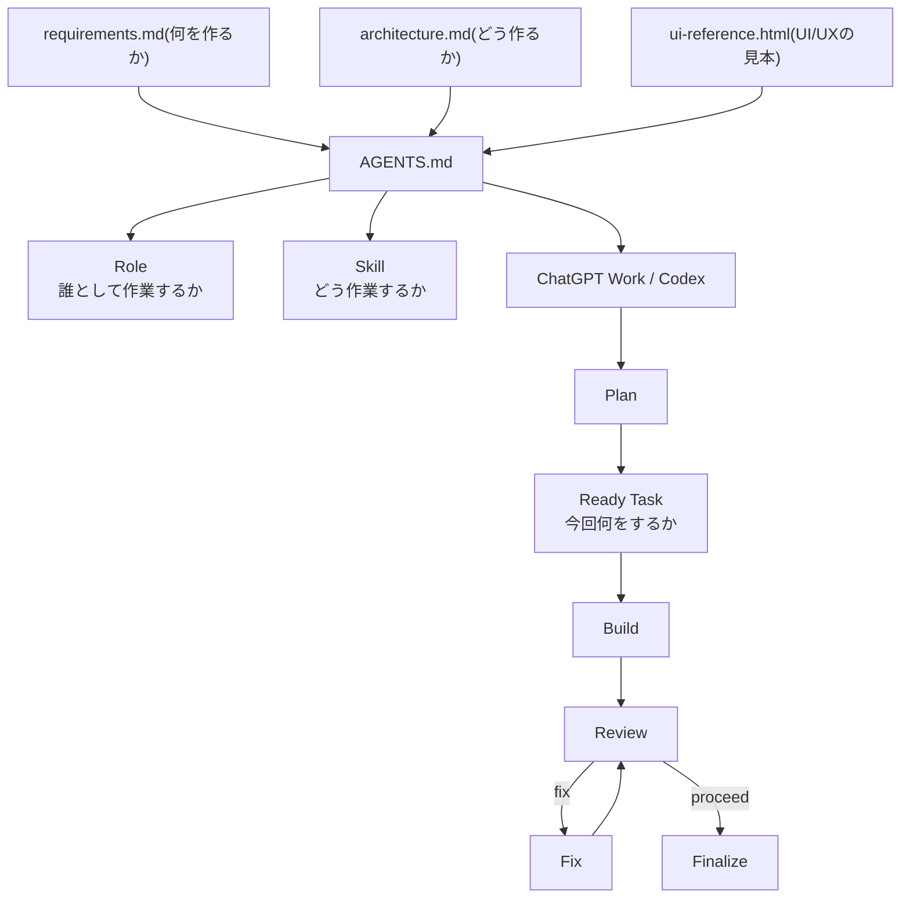

# AI設計

## 計画から方針までをプロンプトで作成

応用情報技術者試験Webアプリ作成 プロンプト手順.md

1. 「計画」を設計する：どういう風にAIに指示をしていくかの順番を決める
2. 「指示」を設計する：どういう風にAIに指示をしていくかの内容を決める
3. 「方針」を生成する：それぞれの指示でどこまでするかの範囲を決める

結果：Chat GPTだけでなくWorkやCodexの利用もしていかないといけない

「仕組み」を設計する

### Role(役割)

- **orchestrator**
  - Codexのメインスレッドとして状態遷移とユーザー対話を管理する
  - カスタムエージェントとしては作成しない
- **planner**
  - 実装前の仕様確定、Source of Truth更新、Task準備を担当する
- **builder**
  - `Ready` Taskの実装だけを担当し、正式Reviewは行わない
- **reviewer**
  - 機能単位レビュー専任で、アプリケーションコードは変更しない
- **fixer**
  - Reviewで確認されたCritical / Highの修正だけを担当する
- **finalizer**
  - 完了Gateを確認して指定TaskをDoneにし、Integration ReviewのMandatory fixでは再開Gateを確認してDone TaskをReadyへ戻す
- **release-auditor**
  - アプリ全体またはデプロイ可否を確認し、アプリケーションコードは変更しない

### Codex専用Custom Agent

- **workflow_analyst**
  - Codexで独立した読み取り専用調査を担当し、成果物は書き込まない
  - 対応する`.agents/roles/*.md`は持たず、ChatGPT WorkのRoleとして扱わない

### Skill(手順)

- **foundation**
  - プロンプト手順のPhase 4でVueアプリ基盤だけを作る
- **orchestrate-feature-cycle**
  - プロンプト手順のPhase 5で、CodexによるPlanからFinalizeまでの状態遷移、Gate、停止・再開を管理する
- **plan-feature-change**
  - 実装前の差分・影響分析、質問、確定内容の反映、Task準備を行う。Done Taskへの通常変更は差分専用の新しいTaskにする
- **implement-feature**
  - `Ready` TaskのBuildを行う
- **review-feature**
  - 機能単位のReviewを行い、結果を`.agents/reviews/<task>-review.md`へ保存する
- **fix-review**
  - ReviewerのCritical / High指摘を検証し、必要最小限のFixを行う
- **finalize-task**
  - 最新Reviewと検証結果を確認し、条件を満たすTaskを`Done`にする
- **reopen-task**
  - Integration ReviewのMandatory fixに対応するDone Taskを、証跡を保って`Ready`へ戻す
- **integration-review**
  - プロンプト手順のPhase 6でMVP全体を横断して確認する
- **remediate-integration-review**
  - Phase 6のNG後に、remediation baselineを維持しながらMandatory fix、Feature Review、Finalize、統合レビュー再実行を管理する
- **deploy-readiness**
  - プロンプト手順のPhase 7でCloudflare Pagesへのデプロイ可否を確認する

### Tasks(今回の作業)

- TEMPLATE.md：新しいTaskを作るための雛形

## 実際に実装させる

- 仕組みで「実装」を行う

## 運用方針を設計する

- 機能を変更する際の計画・指示・方針の設計
- 機能を文書化する際の計画・指示・方針の設計
