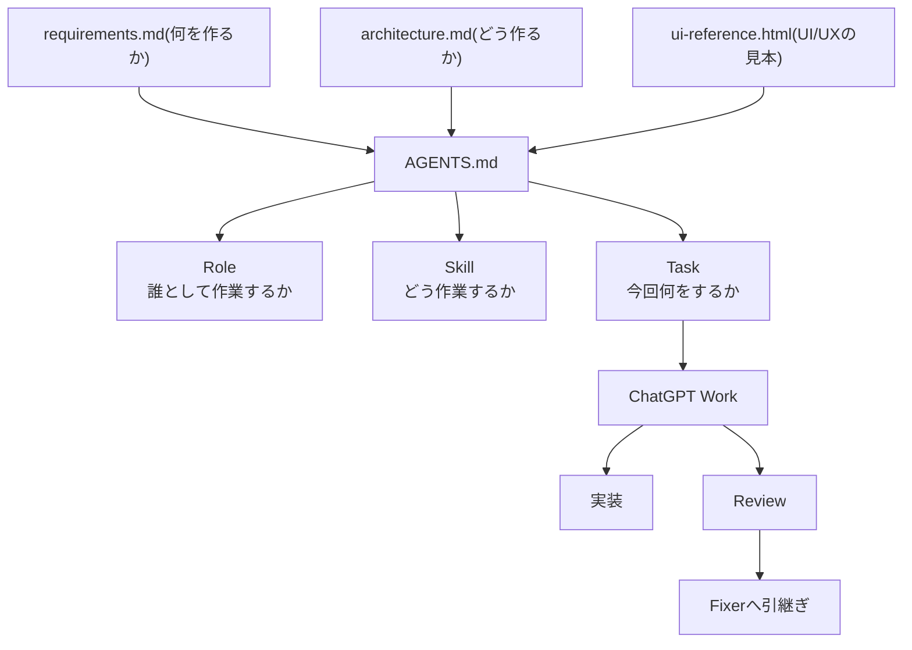

# AI設計

応用情報技術者試験Webアプリ作成 プロンプト手順.md

1. 「計画」を設計する：どういう風にAIに指示をしていくかの順番を決める
2. 「指示」を設計する：どういう風にAIに指示をしていくかの内容を決める
3. 「方針」を生成する：それぞれの指示でどこまでするかの範囲を決める

結果：Chat GPTだけでなくWorkやCodexの利用もしていかないといけない

「仕組み」を設計する

### Role(役割)

- **builder**
  - 実装担当。方針や設計、指定されたタスク外、
  - 自分の書いたコードを正しいと思い込ませないため直させないレビューはさせない
- **reviewer**
  - レビュー専任。
  - コードは直さない
- **fixer**
  - レビュー指摘の修正専任
  - 変更範囲を広げやすいためCritical / Highだけを修正対象と制限させる
- **release-auditor**
  - アプリ全体・リリース可能性を見る担当
  - 動作確認はするがアプリコードは変更しない

### Skill(手順)

- **foundation**
  - Phase 4専用:Vueアプリ基盤だけを作る手順
  - アプリ基盤作成は通常の機能追加と少し性質が違うため最初の1回だけ使用
- **implement-feature**
  - Phase 5以降の通常の機能実装手順
  - 仕様未確定のまま勝手に実装されるのを防ぐ考慮
- **review-feature**
  - Phase 6の機能単位レビュー手順
  - レビュー結果を.agents/reviews/xxx-review.mdへ保存
- **fix-review**
  - Phase 7のレビュー修正手順
  - Reviewerの指摘が間違っている場合無理に修正しないようにしている
- **integration-review**
  - Phase 9専用で個別Taskではなく、MVP全体を横断して確認します
- **deploy-readiness**
  - Phase 10専用。Cloudflare Pagesへデプロイ可能かだけ確認

### Tasks(今回の作業)

- TEMPLATE.md：新しいTaskを作るための雛形

- 仕組みで「実装」を行う
