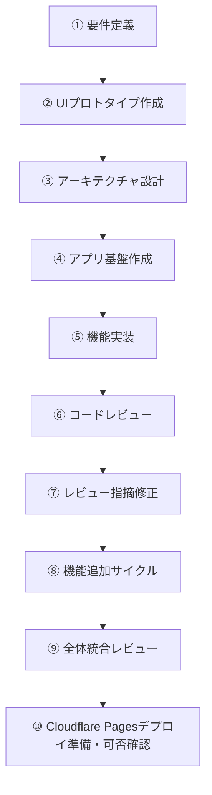
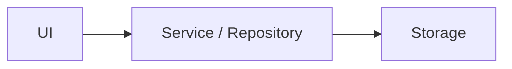
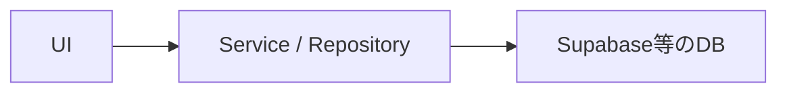

# AI開発プロンプト手順

## 1. 目的

本手順は、ChatGPT Plus / ChatGPT Workを中心に、必要に応じてCodexを利用しながら、Webアプリを効率よく開発するための標準フローを定義する。

主な目的は以下。

- AIへの指示を標準化する
- 一度に大きな実装を依頼せず、品質を安定させる
- 利用量を抑えながら必要な場面だけ高性能モデルを利用する
- HTMLプロトタイプをUI仕様として活用する
- ローカルで開発できる構成にする
- 低コストでWeb公開できる構成にする
- 将来的な機能追加やDB導入を容易にする

---

# 2. 基本方針

AI開発では、以下の順番を守る。



### 制約

`このHTMLを参考にアプリ全体を完成させてください。`のような丸投げの指示はしないこと

一度に多数の責務をAIへ渡さず、1タスクごとに明確なスコープと完了条件を設定する。

### 利用環境の基本方針

```text
プラン          ：ChatGPT Plus
要件・設計      ：ChatGPT Plus
実装・テスト    ：ChatGPT Work（デスクトップ）
難しい開発作業  ：Codex（必要時のみ）
Web公開先       ：Cloudflare Pages
本手順の完了地点：Cloudflare Pagesへデプロイ可能と確認できた状態
```

---

# 3. AIへ渡す情報

HTMLだけを仕様として利用しない。

プロジェクトでは最低限、以下を管理する。

```text
project/
├─ AGENTS.md
│
├─ docs/
│  ├─ requirements.md -- 機能要件・MVP範囲のSource of Truth
│  ├─ architecture.md -- 実装方式・責務分離・データ構造のSource of Truth
│  └─ ui-reference.html -- UI・画面表現・操作イメージのSource of Truth
│
├─ .agents/
│  ├─ README.md
│  │
│  ├─ roles/
│  │  ├─ builder.md
│  │  ├─ reviewer.md
│  │  ├─ fixer.md
│  │  └─ release-auditor.md
│  │
│  ├─ skills/
│  │  ├─ foundation/
│  │  │  └─ SKILL.md
│  │  ├─ implement-feature/
│  │  │  └─ SKILL.md
│  │  ├─ review-feature/
│  │  │  └─ SKILL.md
│  │  ├─ fix-review/
│  │  │  └─ SKILL.md
│  │  ├─ integration-review/
│  │  │  └─ SKILL.md
│  │  └─ deploy-readiness/
│  │     └─ SKILL.md
│  │
│  ├─ tasks/
│  │  ├─ TEMPLATE.md
│  │  ├─ 001-foundation.md
│  │  ├─ 002-learning-history.md
│  │  └─ 003-sort-visualizer.md
│  │
│  └─ reviews/
│     └─ TEMPLATE.md
││
├─ src/ -- 現在の実装状態
├─ package.json
└─ README.md -- 開発・起動方法
```

AIへ指示するときは可能な限り以下をコンテキストとして利用する。

```text
要件
+
設計
+
UI仕様
+
現在のコード
+
今回実施する内容
```

資料間に矛盾がある場合は、AIが勝手に解釈して実装を進めない。矛盾箇所を報告し、要件に関わる判断が必要な場合は確認事項として提示する。

---

# 4. 推奨技術構成

MVPでは以下を基本構成とする。

```text
Node.js LTS / npm
Vite
Vue 3
TypeScript
Vue Router（複数画面を持つ場合）
CSS
Vitest
Cloudflare Pages（Web公開先）
```

初期段階では原則として以下を導入しない。

- 独自バックエンド
- 認証
- DB
- Docker
- AWS等の複雑なクラウド構成
- Pinia等のグローバル状態管理ライブラリ（必要性が明確になるまでは導入しない）
- マイクロサービス

ローカルでは以下で起動できる状態を維持する。

```bash
npm install
npm run dev
```

本番用ビルドは以下。

```bash
npm run build
```

テストと本番ビルドのローカル確認は、以下のコマンドを利用できる状態を基本とする。

```bash
npm run test
npm run preview
```

`npm run test` はCIやAI実行でも終了するよう、Vitestのwatchモードではなく1回実行（`vitest run`）を基本とする。`npm run preview` は本番ビルドの表示確認後に停止する。

---

# 5. データ保存方針

MVPでは可能であれば以下を利用する。

- localStorage
- IndexedDB

ただしUIから直接localStorage等を操作しない。



将来的に以下のような置き換えができる構造とする。



---

# 6. モデル選択ルール

本手順はChatGPT Plusを前提とする。

利用量を抑えるため、すべての作業で最高性能のモデル・推論設定を利用しない。利用する環境によって選択肢が異なるため、通常のChatGPTとChatGPT Workを分けて考え、CodexはWorkで解決困難な場合のみ利用する。

## ChatGPTでの選択

要件整理、UI検討、アーキテクチャ設計など、リポジトリを直接編集しない作業で利用する。

```text
軽い整理・文言修正 → Instant
通常の要件整理・UI検討 → Medium
重要な設計・難しいレビュー → High
```

ChatGPT PlusではInstant / Medium / Highを基本的な選択肢とする。PlusではProを前提にしない。通常作業では必要以上にHighを選ばず、Mediumを基本とする。

## ChatGPT Workでの選択

ローカルファイルやリポジトリを扱う実装・テスト・レビューでは、ChatGPTデスクトップアプリのWorkを基本環境とする。

```text
軽微な修正・単純作業 → GPT-5.6 Luna
通常の実装・テスト・修正 → GPT-5.6 Terra
複雑な設計判断・難しいバグ解析・重要レビュー → GPT-5.6 Sol
```

基本的な開発ではGPT-5.6 Terraをデフォルトとし、GPT-5.6 Lunaは単純作業、GPT-5.6 Solは品質上の効果が大きい場面に限定する。

## Codexを利用する条件

Codexは通常の開発環境として常用せず、ChatGPT Workでの対応が難しい場合に利用する。

主な利用例：

- 原因の切り分けが難しいバグを、リポジトリ・ターミナル・開発ツールを横断して調査する場合
- 広範囲のコード変更や複雑なリファクタリングが必要な場合
- Workで複数回修正してもテストやビルドが安定しない場合
- コードベース全体を対象とする専門的な実装・デバッグ作業が必要な場合

Codexを利用する場合も、モデル選択はWorkと同様に、通常はGPT-5.6 Terra、難しい問題のみGPT-5.6 Solを基本とする。

---

# 7. プロンプト基本フォーマット

原則としてすべての開発プロンプトを以下の構成で作成する。

```text
# 目的

今回達成したいこと

# コンテキスト

関連する要件・設計・既存機能

# 今回のスコープ

今回実施する内容

# スコープ外

今回変更・実装しない内容

# 制約

技術・設計・UI等の制約

# 完了条件

□ 条件1
□ 条件2
□ 条件3

# 作業後の報告

1. 変更内容
2. 変更ファイル
3. テスト結果
4. 未解決事項
```

---

# 8. Phase 1：要件定義

## 目的

実装前にMVPの範囲とアプリの責務を決める。

## 推奨モデル

```text
ChatGPT Medium
```

要件間のトレードオフやMVP範囲の判断が難しい場合のみHighを利用する。

## 推奨環境

```text
ChatGPT Plus
```

## プロンプト例

```md
今回の目的はWebアプリの要件定義です。

まだ実装はしないでください。

# 作りたいもの

[アプリ概要]

# 想定ユーザー

[利用者]

# 解決したい課題

[課題]

# 必要だと考えている機能

[機能一覧]

# 技術上の条件

・ローカルで開発できること
・低コストでWeb公開できること
・スマートフォンで利用できること
・将来的な機能追加がしやすいこと

# 確認してほしいこと

・MVPとして大きすぎないか
・不要な機能がないか
・機能ごとの責務が明確か
・将来的な拡張を妨げないか

# 完了条件

□ MVPが定義されている
□ 機能一覧が決まっている
□ 画面一覧が決まっている
□ 画面遷移が決まっている
□ MVP対象外が明確になっている

最後に、確定した要件をMarkdown形式でまとめてください。
```

成果物：

```text
docs/requirements.md
```

---

# 9. Phase 2：UIプロトタイプ作成

## 目的

実装前に画面構成・操作感を確認する。

HTMLは本番コードではなく、UI仕様として扱う。

## 推奨モデル

```text
ChatGPT Medium
```

複雑な画面構成や情報設計の判断が必要な場合のみHighを利用する。

## 推奨環境

```text
ChatGPT Plus
```

## プロンプト例

```md
以下の要件をもとに、
UI確認用のプロトタイプを作成してください。

# 目的

実装ではなく、

・画面構成
・情報設計
・操作性
・レスポンシブ表示
・UIの分かりやすさ

を確認することです。

# 実装形式

HTML / CSS / JavaScriptを1ファイルにまとめてください。

# 要件

[requirements.mdの内容または対象要件]

# 制約

・バックエンド不要
・DB不要
・認証不要
・ダミーデータでよい
・スマートフォン表示も考慮する

# 完了条件

□ 必要な情報が画面上に存在する
□ 基本操作を確認できる
□ PCで確認できる
□ スマートフォン幅でも破綻しない
```

成果物：

```text
docs/ui-reference.html
```

---

# 10. Phase 3：アーキテクチャ設計

## 目的

UIプロトタイプを、本番アプリへ変換するための内部設計を決める。

## 推奨モデル

```text
ChatGPT High
```

## 推奨環境

```text
ChatGPT Plus
```

## プロンプト例

```md
添付されている要件定義とHTMLは、
これから実装するWebアプリの仕様です。

HTMLをそのまま本番コードとして利用するのではなく、
Vue 3 + TypeScript + Viteで実装するための
アーキテクチャを設計してください。

今回は設計のみです。
実装はしないでください。

# 条件

・ローカル開発可能
・Cloudflare Pagesへ静的デプロイ可能
・スマートフォン対応
・Vue 3のComposition APIを基本とする
・機能追加しやすい
・UIとロジックを分離する
・データ保存処理をUIから分離する
・将来的にDBを追加可能
・MVPではバックエンド不要
・Pinia等のグローバル状態管理は必要性が明確な場合のみ採用する
・過剰設計を避ける

# 確認事項

・MVPとして構成が大きすぎないか
・各機能の責務が明確か
・機能間の依存が強すぎないか
・将来的な追加機能に対応できるか
・不要な抽象化がないか

# 出力

1. 技術構成
2. アーキテクチャ
3. ディレクトリ構成
4. 画面構成
5. コンポーネント構成
6. データ構造
7. 状態管理方針
8. 永続化方針
9. テスト方針
10. 実装順序

# 完了条件

□ 技術構成が決まっている
□ ディレクトリ構成が決まっている
□ 各機能の責務が決まっている
□ データ構造が決まっている
□ 状態管理方法が決まっている
□ 実装順序が決まっている

最後に確定した設計をMarkdown形式で出力してください。
```

成果物：

```text
docs/architecture.md
```

---

# 11. Phase 4：アプリ基盤作成

## 目的

機能を実装する前に、最低限のアプリケーション基盤だけを作る。

## 推奨モデル

```text
GPT-5.6 Terra
```

基盤構成が複雑、またはarchitecture.mdからの実装判断が難しい場合のみGPT-5.6 Solを利用する。

## 推奨環境

```text
基本：ChatGPT Work（デスクトップでローカルフォルダを使用）
必要時のみ：Codex（デスクトップ）
```

Codexは、Workでの実装・テスト・原因調査で解決できない場合に限って利用する。

## プロンプト例

```text
AGENTS.mdを確認してください。

今回はBuilderとして作業してください。

Role:
.agents/roles/builder.md

Skill:
.agents/skills/foundation/SKILL.md

Task:
.agents/tasks/001-foundation.md

上記と必要なSource of Truthを読んでから、
Taskの範囲だけ実装してください。

Task外の実装や設計変更は行わないでください。

完了後はAGENTS.mdで指定された形式だけ報告してください。
```

---

# 12. Phase 5：機能実装

## 目的

1回のプロンプトにつき、原則1機能だけ実装する。

例えば「ソート可視化」を実装するときに、「問題演習」「学習履歴」「苦手分析」まで同時に実装しない。

## 推奨モデル

```text
GPT-5.6 Terra
```

複雑なアルゴリズム、原因の切り分けが難しい実装、設計判断を伴う場合のみGPT-5.6 Solを利用する。

## 推奨環境

```text
基本：ChatGPT Work（デスクトップでローカルフォルダを使用）
必要時のみ：Codex（デスクトップ）
```

## プロンプト例

```text
AGENTS.mdを確認してください。

今回はBuilderとして作業してください。

Role:
.agents/roles/builder.md

Skill:
.agents/skills/implement-feature/SKILL.md

Task:
.agents/tasks/[task].md

TaskのStatusと依存Taskを最初に確認してください。

Readyの場合のみ実装し、
完了後はnpm run testとnpm run buildを実行してください。
```

---

# 13. Phase 6：コードレビュー

## 目的

実装とレビューは別タスクとして実施し、実装した機能が要件・設計・品質基準を満たしているか確認する。

レビュー時にはコードを変更しない。

## 推奨モデル

```text
GPT-5.6 Terra
```

通常の機能単位レビューはGPT-5.6 Terraを基本とする。アーキテクチャへの影響が大きい変更、複数機能にまたがる変更、重大な不具合の可能性がある場合のみGPT-5.6 Solを利用する。

## 推奨環境

```text
基本：ChatGPT Work（デスクトップでローカルフォルダを使用）
必要時のみ：Codex（デスクトップ）

※別Workチャット
```

## プロンプト例

```text
AGENTS.mdを確認してください。

今回はReviewerとして作業してください。

Role:
.agents/roles/reviewer.md

Skill:
.agents/skills/review-feature/SKILL.md

Task:
.agents/tasks/[task].md

現在の実装をレビューしてください。

アプリケーションコードは変更しないでください。

レビュー結果だけ、
Taskで指定された.agents/reviews/配下へ保存してください。
```

---

# 14. Phase 7：レビュー指摘修正

## 目的

コードレビューで指摘された問題のうち、リリースや次工程へ進むうえで重要なCritical / Highを必要最小限の変更で修正する。

## 推奨モデル

```text
GPT-5.6 Terra
```

修正に設計判断が必要な場合や、原因がレビュー指摘だけでは確定できない場合のみGPT-5.6 Solを利用する。

## 推奨環境

```text
基本：ChatGPT Work（デスクトップでローカルフォルダを使用）
必要時のみ：Codex（デスクトップ）
```

## プロンプト例

```text
AGENTS.mdを確認してください。

今回はFixerとして作業してください。

Role:
.agents/roles/fixer.md

Skill:
.agents/skills/fix-review/SKILL.md

Task:
.agents/tasks/[task].md

Review:
.agents/reviews/[review].md

Critical / Highだけを必要最小限で修正してください。

Medium / Lowは変更しないでください。
```

---

# 15. Phase 8：機能追加を繰り返す

## 目的

1機能ごとに「機能実装 → レビュー → Critical / High修正 → テスト」のサイクルを繰り返し、既存品質を維持しながらMVP機能を順番に追加する。

例：

```text
ソート可視化
↓
レビュー
↓
修正
↓
問題演習
↓
レビュー
↓
修正
↓
学習履歴
↓
レビュー
↓
修正
```

## 推奨モデル

```text
実装・修正：GPT-5.6 Terra
通常レビュー：GPT-5.6 Terra
重要レビュー：GPT-5.6 Sol
```

軽微な実装・修正ではGPT-5.6 Lunaも利用できる。GPT-5.6 Solはアーキテクチャへの影響が大きいレビューや複雑な問題に限定する。

## 推奨環境

```text
基本：ChatGPT Work（デスクトップでローカルフォルダを使用）
必要時のみ：Codex（デスクトップ）
```

## プロンプト例

```text
次のMVP機能として「[機能名]」を追加してください。

Phase 5〜7のルールに従い、まず今回の機能だけを実装してください。

# コンテキスト

・requirements.md
・architecture.md
・現在のリポジトリ
・必要に応じてui-reference.html

# 今回のスコープ

[実装内容]

# スコープ外

・今回対象ではないMVP機能
・将来機能
・architecture.mdの変更
・requirements.mdの変更

# 制約

・既存機能を壊さない
・1機能の責務を必要以上に広げない
・既存アーキテクチャを維持する
・変更範囲を必要最小限にする

# 完了条件

□ 対象機能が要件どおり動作する
□ npm run build が成功する
□ npm run test が成功する
□ 既存機能を壊していない

# 作業後の報告

1. 変更ファイル
2. 実装内容
3. テスト結果
4. 未解決事項

このプロンプトでは実装だけを行い、レビューやレビュー指摘修正は実施しないでください。
実装完了後、Phase 6とPhase 7のプロンプトを別タスクとして使用します。
```

---

# 16. Phase 9：全体統合レビュー

## 目的

すべてのMVP機能が完成した段階で、アプリ全体が要件・設計に沿って統合され、リリース可能な状態か確認する。

## 推奨モデル

```text
GPT-5.6 Sol
```

## 推奨環境

```text
基本：ChatGPT Work（デスクトップでローカルフォルダを使用）
必要時のみ：Codex（デスクトップ）
```

## プロンプト例

```text
AGENTS.mdを確認してください。

今回はRelease Auditorとして作業してください。

Role:
.agents/roles/release-auditor.md

Skill:
.agents/skills/integration-review/SKILL.md

requirements.mdとarchitecture.mdを基準として、
現在のMVP全体をレビューしてください。

アプリケーションコードは変更しないでください。
```

---

# 17. Phase 10：Cloudflare Pagesデプロイ準備・可否確認

## 目的

MVPをCloudflare Pagesへ低コストで公開できる状態か確認する。実際のデプロイ操作はこのPhaseでは行わない。

想定構成：

```text
ローカル
↓
GitHub
↓
Cloudflare Pages
↓
Web公開（本手順ではデプロイ実行前まで）
```

## 推奨モデル

```text
GPT-5.6 Terra
```

デプロイ固有の問題や原因不明のビルドエラーがある場合のみGPT-5.6 Solを利用する。

## 推奨環境

```text
基本：ChatGPT Work（デスクトップでローカルフォルダを使用）
必要時のみ：Codex（デスクトップ）
```

## プロンプト例

```text
AGENTS.mdを確認してください。

今回はRelease Auditorとして作業してください。

Role:
.agents/roles/release-auditor.md

Skill:
.agents/skills/deploy-readiness/SKILL.md

Cloudflare Pagesへデプロイ可能な状態か確認してください。

実際のデプロイ、GitHubへのpush、
Cloudflare側設定変更は行わないでください。
```

---

# 18. Workで失敗した場合の修正ルール（必要時Codex）

ChatGPT Workで期待する結果が得られなかった場合、最初から作り直させない。

失敗原因に応じて修正プロンプトを使い、Workでの修正を優先する。複数回の修正でも原因特定や解決が難しい場合のみCodexへ切り替える。

---

## ケース1：変更範囲が広すぎる

```text
今回の変更範囲が要求より広くなっています。

既存機能への不要な変更を取り消し、
以下だけを変更してください。

# 変更対象

[対象]

# 変更禁止

[対象外]

今回の目的達成に必要な最小変更にしてください。

完了後、
変更したファイル一覧と理由だけ報告してください。
```

---

## ケース2：勝手に設計変更された

```text
現在の実装はarchitecture.mdの設計から逸脱しています。

architecture.mdをSource of Truthとして、
今回追加した部分のみ設計に合わせて修正してください。

architecture.md自体は変更しないでください。

設計変更が必要だと判断した場合も、
勝手に変更せず理由だけ報告してください。
```

---

## ケース3：機能は動くがコードが複雑

```text
現在の機能仕様は変更せず、
今回追加したコードだけレビューしてください。

以下を重点的に確認してください。

・不要な抽象化
・重複コード
・責務の混在
・巨大なコンポーネント
・過剰な状態管理

改善が必要な場合も、
まず修正案だけ提示してください。

今回はまだコードを変更しないでください。
```

---

## ケース4：UIがHTMLと違う

```text
機能自体は変更せず、
UIを添付HTMLに近づけてください。

添付HTMLはUI仕様として扱ってください。

# 今回変更してよいもの

・レイアウト
・CSS
・表示要素
・レスポンシブ対応

# 変更してはいけないもの

・ビジネスロジック
・データ構造
・既存API
・既存テストの仕様

完了後、UI関連で変更した内容のみ報告してください。
```

---

## ケース5：バグが直らない

この段階で高推論モデルへ切り替える。

```text
以下のバグについて原因分析をしてください。

まだコードは変更しないでください。

# 現象

[バグ内容]

# 再現手順

1.
2.
3.

# 期待動作

[期待結果]

# 実際の動作

[実際の結果]

# 調査してほしいこと

1. 根本原因
2. 関連するファイル
3. 修正候補
4. 各候補のリスク
5. 最小変更で直す方法

推測だけで修正を始めず、
まず原因を特定してください。
```

原因確定後、別タスクで修正する。

---

# 19. プロンプト設計ルール

AIへの指示では以下を優先する。

## 推奨

```text
目的
コンテキスト
スコープ
スコープ外
制約
完了条件
出力形式
```

## 必要に応じて利用

- 良い出力例
- 悪い出力例
- 変更可能ファイル
- 変更禁止ファイル
- テスト方法

## 原則不要

```text
あなたは世界最高のエンジニアです。
```

のような役割演出。

また、

```text
Step 1で考えて
Step 2で考えて
Step 3で……
```

と内部思考方法を細かく指定するより、

```text
この条件を満たしてください。
```

と成果条件を明確にする。

---

# 20. 使用量を抑えるルール

## 20.1 毎回巨大なHTMLを貼らない

可能であればプロジェクト内に保存し、

```text
ui-reference.htmlを参照してください。
```

とする。

---

## 20.2 コード全文を回答させない

ChatGPT Work（または必要時のCodex）が直接リポジトリを編集できる場合は、

```text
コード全文は回答に貼らないでください。

以下のみ報告してください。

・変更ファイル
・変更概要
・テスト結果
・残課題
```

とする。

---

## 20.3 1機能ずつ処理する

悪い例：

```text
教材、問題、履歴、分析を全部実装してください。
```

良い例：

```text
今回はソート可視化だけ実装してください。
```

---

## 20.4 高性能モデルを常用しない

```text
ChatGPT Plusでの軽い整理 → Instant
ChatGPT Plusでの通常相談 → Medium
ChatGPT Plusでの重要設計 → High
ChatGPT Workでの通常実装 → GPT-5.6 Terra
ChatGPT Workでの軽微修正 → GPT-5.6 Luna
ChatGPT Workでの難しい問題・重要レビュー → GPT-5.6 Sol
Codex → Workで解決困難なコード実装・デバッグ時のみ利用
```

とする。

---

# 21. 開発時の禁止事項

AIに以下を許可しない。

- 要求されていない機能追加
- 不要な大規模リファクタリング
- architecture.mdの無断変更
- requirements.mdの無断変更
- 将来機能の先回り実装
- 必要性の低いライブラリ追加
- 動作確認を行わず「完成」と判断すること
- テスト失敗を無視すること
- UIから直接永続化処理を書くこと
- 1コンポーネントへ多数の責務を集中させること

---

# 22. 推奨するプロジェクト全体フロー

```text
ChatGPT Plus
│
├─ 要件整理
│
├─ UI相談
│
└─ プロンプト作成
     │
     ▼
requirements.md
     │
     ▼
ui-reference.html
     │
     ▼
architecture.md
     │
     ▼
ChatGPT Work（基本）
必要時のみCodex
     │
     ├─ アプリ基盤
     │
     ├─ 機能A
     │    ├─ 実装
     │    ├─ レビュー
     │    └─ 修正
     │
     ├─ 機能B
     │    ├─ 実装
     │    ├─ レビュー
     │    └─ 修正
     │
     ├─ 機能C
     │    ├─ 実装
     │    ├─ レビュー
     │    └─ 修正
     │
     ▼
統合レビュー
     │
     ▼
npm run build
     │
     ▼
GitHub
     │
     ▼
Cloudflare Pages
デプロイ可否確認
     │
     ▼
手順完了
```

---

# 23. 最重要ルール

AI開発では、

```text
良いプロンプトを1回作る
```

ことより、

```text
要件
↓
設計
↓
実装
↓
レビュー
↓
修正
↓
テスト
```

という工程を守ることを優先する。

また、1回のプロンプトでは、

> 「今回何を完成させればよいか」

を明確にし、

> 「今回何をしてはいけないか」

も同時に指定する。

この2つをすべての開発タスクで共通ルールとする。
