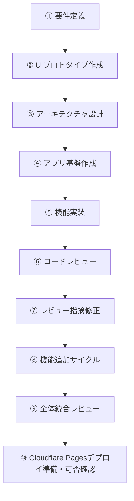
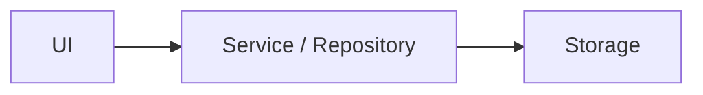
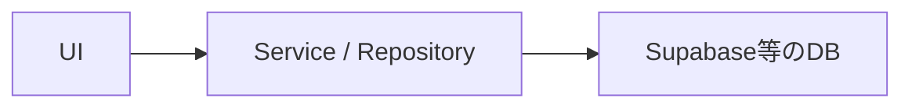

# AI開発プロンプト手順

## 1. 目的

本手順は、ChatGPT Plus / ChatGPT Workを中心に、必要に応じてCodexを利用しながら、Webアプリを効率よく開発するための標準フローを定義する。

主な目的は以下。

- AIへの指示を標準化する
- 一度に大きな実装を依頼せず、品質を安定させる
- 利用量を抑えながら必要な場面だけ高性能モデルを利用する
- HTMLプロトタイプをUI仕様として活用する
- ローカルで開発できる構成にする
- 低コストでWeb公開できる構成にする
- 将来的な機能追加やDB導入を容易にする

---

# 2. 基本方針

AI開発では、以下の順番を守る。



### 制約

`このHTMLを参考にアプリ全体を完成させてください。`のような丸投げの指示はしないこと

一度に多数の責務をAIへ渡さず、1タスクごとに明確なスコープと完了条件を設定する。

### 利用環境の基本方針

```text
プラン          ：ChatGPT Plus
要件・設計      ：ChatGPT Plus
実装・テスト    ：ChatGPT Work（デスクトップ）
機能サイクル管理・難しい開発作業：Codex
Web公開先       ：Cloudflare Pages
本手順の完了地点：Cloudflare Pagesへデプロイ可能と確認できた状態
```

---

# 3. AIへ渡す情報

HTMLだけを仕様として利用しない。

プロジェクトでは最低限、以下を管理する。

```text
project/
├─ AGENTS.md
│
├─ doc/
│  ├─ requirements.md -- 機能要件・MVP範囲のSource of Truth
│  ├─ architecture.md -- 実装方式・責務分離・データ構造のSource of Truth
│  └─ ui-reference.html -- UI・画面表現・操作イメージのSource of Truth
│
├─ .agents/
│  ├─ README.md
│  │
│  ├─ roles/
│  │  ├─ orchestrator.md
│  │  ├─ planner.md
│  │  ├─ builder.md
│  │  ├─ reviewer.md
│  │  ├─ fixer.md
│  │  ├─ finalizer.md
│  │  └─ release-auditor.md
│  │
│  ├─ skills/
│  │  ├─ orchestrate-feature-cycle/
│  │  │  └─ SKILL.md
│  │  ├─ plan-feature-change/
│  │  │  └─ SKILL.md
│  │  ├─ foundation/
│  │  │  └─ SKILL.md
│  │  ├─ implement-feature/
│  │  │  └─ SKILL.md
│  │  ├─ review-feature/
│  │  │  └─ SKILL.md
│  │  ├─ fix-review/
│  │  │  └─ SKILL.md
│  │  ├─ finalize-task/
│  │  │  └─ SKILL.md
│  │  ├─ integration-review/
│  │  │  └─ SKILL.md
│  │  └─ deploy-readiness/
│  │     └─ SKILL.md
│  │
│  ├─ tasks/
│  │  ├─ TEMPLATE.md
│  │  ├─ 001-foundation.md
│  │  ├─ 002-learning-history.md
│  │  └─ 003-sort-visualizer.md
│  │
│  └─ reviews/
│     └─ TEMPLATE.md
│
├─ .codex/
│  └─ agents/
│     ├─ planner.toml
│     ├─ builder.toml
│     ├─ reviewer.toml
│     ├─ fixer.toml
│     ├─ finalizer.toml
│     └─ release-auditor.toml
│
├─ src/ -- 現在の実装状態
├─ package.json
└─ README.md -- 開発・起動方法
```

AIへ指示するときは可能な限り以下をコンテキストとして利用する。

```text
要件
+
設計
+
UI仕様
+
現在のコード
+
今回実施する内容
```

資料間に矛盾がある場合は、AIが勝手に解釈して実装を進めない。矛盾箇所を報告し、要件に関わる判断が必要な場合は確認事項として提示する。

### Candidate Referenceの扱い

機能ごとに作成したHTML、モック、メモ、参考実装等は、
Source of TruthではなくCandidate Referenceとして扱う。

Candidate Referenceからは、

- 画面要素
- 操作
- 状態変化
- 説明内容
- 実装候補

を抽出してよい。

ただし、Source of Truthと異なる内容を自動採用しない。
相違点を質問し、ユーザーが採用を確定した後に、
責務を持つSource of Truthへ反映する。

### RoleとCodex Custom Agentの使い分け

ChatGPT Workでは、`.agents/roles/*.md` を
プロンプトから明示的に指定する。

Codexでは、`.codex/agents/*.toml` の
カスタムエージェントへ対象作業を明示的に委譲する。

1つの機能変更を計画から完了まで進める場合は、
各工程でCodexのメインスレッドを親Orchestratorとして使用する。
Orchestratorは `.codex/agents` の子エージェントではない。

```text
orchestrator    → メインスレッドとしてRole間の状態遷移とユーザー対話を管理
planner         → 機能変更計画、Source of Truth更新、Task準備
builder         → Ready Taskの実装
reviewer        → 機能レビュー
fixer           → Critical / High修正
finalizer       → 最終Review・test・build確認後のTask完了確定
release_auditor → 統合・デプロイ可否レビュー
```

`.agents/skills/*/SKILL.md` と `.agents/tasks/*.md` は、
WorkとCodexの両方で共通の作業手順・要求として利用する。

Codexへ委譲する場合の基本形：

```text
AGENTS.mdを確認してください。

カスタムエージェント[agent-name]に、
以下のSkillとTaskに従う作業を委譲してください。

Skill:
.agents/skills/[skill-name]/SKILL.md

Task:
.agents/tasks/[task].md

対象エージェントの完了を待ち、
結果をAGENTS.mdの形式で統合して報告してください。
```

上記は単独工程を手動実行する場合の基本形である。

本手順のPhase 8では、Phase 8-A / 8-B、Phase 8-C、Phase 8-Dを
それぞれ独立したプロンプトとして実行し、TaskとReview成果物で受け渡す。

Phase 5〜8の状態遷移は親が順番に管理し、
builder、Review成果物を書き込むreviewer、fixer、finalizerを同時に起動しない。

限定的な並列実行は以下の読み取り専用調査だけに使用する。

- Plannerの差分・影響調査：最大2並列
- 重要レビューの観点別調査：最大2並列
- Phase 9の統合レビュー調査：最大3並列

並列調査担当はファイルを変更しない。
調査後、指定された1つのRoleだけが成果物を書き込む。
小規模で明確なTaskは並列化しない。

---

# 4. 推奨技術構成

MVPでは以下を基本構成とする。

```text
Node.js LTS / npm
Vite
Vue 3
TypeScript
Vue Router（複数画面を持つ場合）
CSS
Vitest
Cloudflare Pages（Web公開先）
```

初期段階では原則として以下を導入しない。

- 独自バックエンド
- 認証
- DB
- Docker
- AWS等の複雑なクラウド構成
- Pinia等のグローバル状態管理ライブラリ（必要性が明確になるまでは導入しない）
- マイクロサービス

ローカルでは以下で起動できる状態を維持する。

```bash
npm install
npm run dev
```

本番用ビルドは以下。

```bash
npm run build
```

テストと本番ビルドのローカル確認は、以下のコマンドを利用できる状態を基本とする。

```bash
npm run test
npm run preview
```

`npm run test` はCIやAI実行でも終了するよう、Vitestのwatchモードではなく1回実行（`vitest run`）を基本とする。`npm run preview` は本番ビルドの表示確認後に停止する。

---

# 5. データ保存方針

MVPでは可能であれば以下を利用する。

- localStorage
- IndexedDB

ただしUIから直接localStorage等を操作しない。



将来的に以下のような置き換えができる構造とする。



---

# 6. モデル選択ルール

本手順はChatGPT Plusを前提とする。

利用量を抑えるため、すべての作業で最高性能のモデル・推論設定を利用しない。利用する環境によって選択肢が異なるため、通常のChatGPTとChatGPT Workを分けて考える。Codexは親Orchestratorによる機能サイクル管理、またはWorkで解決困難な作業に利用する。

## ChatGPTでの選択

要件整理、UI検討、アーキテクチャ設計など、リポジトリを直接編集しない作業で利用する。

```text
軽い整理・文言修正 → Instant
通常の要件整理・UI検討 → Medium
重要な設計・難しいレビュー → High
```

ChatGPT PlusではInstant / Medium / Highを基本的な選択肢とする。PlusではProを前提にしない。通常作業では必要以上にHighを選ばず、Mediumを基本とする。

## ChatGPT Workでの選択

ローカルファイルやリポジトリを扱う実装・テスト・レビューでは、ChatGPTデスクトップアプリのWorkを基本環境とする。

```text
軽微な修正・単純作業 → GPT-5.6 Luna
通常の実装・テスト・修正 → GPT-5.6 Terra
複雑な設計判断・難しいバグ解析・重要レビュー → GPT-5.6 Sol
```

基本的な開発ではGPT-5.6 Terraをデフォルトとし、GPT-5.6 Lunaは単純作業、GPT-5.6 Solは品質上の効果が大きい場面に限定する。

## Codexを利用する条件

Codexは、Phase 5〜8を親Orchestratorが少ないユーザー指示で管理する場合、
またはChatGPT Workでの対応が難しい場合に利用する。

主な利用例：

- PlannerからFinalizerまでをGateに従って順次委譲する場合
- Planner調査、重要レビュー、Phase 9レビューを限定的に並列化する場合
- 原因の切り分けが難しいバグを、リポジトリ・ターミナル・開発ツールを横断して調査する場合
- 広範囲のコード変更や複雑なリファクタリングが必要な場合
- Workで複数回修正してもテストやビルドが安定しない場合
- コードベース全体を対象とする専門的な実装・デバッグ作業が必要な場合

Codexを利用する場合も、モデル選択はWorkと同様に、通常はGPT-5.6 Terra、難しい問題のみGPT-5.6 Solを基本とする。並列サブエージェントは使用量が増えるため、小規模で明確なTaskでは利用しない。

---

# 7. プロンプト基本フォーマット

原則としてすべての開発プロンプトを以下の構成で作成する。

```text
# 目的

今回達成したいこと

# コンテキスト

関連する要件・設計・既存機能

# 今回のスコープ

今回実施する内容

# スコープ外

今回変更・実装しない内容

# 制約

技術・設計・UI等の制約

# 完了条件

□ 条件1
□ 条件2
□ 条件3

# 作業後の報告

1. 変更内容
2. 変更ファイル
3. テスト結果
4. 未解決事項
```

---

# 8. Phase 1：要件定義

## 目的

実装前にMVPの範囲とアプリの責務を決める。

## 推奨モデル

```text
ChatGPT Medium
```

要件間のトレードオフやMVP範囲の判断が難しい場合のみHighを利用する。

## 推奨環境

```text
ChatGPT Plus
```

## プロンプト例

```md
今回の目的はWebアプリの要件定義です。

まだ実装はしないでください。

# 作りたいもの

[アプリ概要]

# 想定ユーザー

[利用者]

# 解決したい課題

[課題]

# 必要だと考えている機能

[機能一覧]

# 技術上の条件

・ローカルで開発できること
・低コストでWeb公開できること
・スマートフォンで利用できること
・将来的な機能追加がしやすいこと

# 確認してほしいこと

・MVPとして大きすぎないか
・不要な機能がないか
・機能ごとの責務が明確か
・将来的な拡張を妨げないか

# 完了条件

□ MVPが定義されている
□ 機能一覧が決まっている
□ 画面一覧が決まっている
□ 画面遷移が決まっている
□ MVP対象外が明確になっている

最後に、確定した要件をMarkdown形式でまとめてください。
```

成果物：

```text
doc/requirements.md
```

---

# 9. Phase 2：UIプロトタイプ作成

## 目的

実装前に画面構成・操作感を確認する。

HTMLは本番コードではなく、UI仕様として扱う。

## 推奨モデル

```text
ChatGPT Medium
```

複雑な画面構成や情報設計の判断が必要な場合のみHighを利用する。

## 推奨環境

```text
ChatGPT Plus
```

## プロンプト例

```md
以下の要件をもとに、
UI確認用のプロトタイプを作成してください。

# 目的

実装ではなく、

・画面構成
・情報設計
・操作性
・レスポンシブ表示
・UIの分かりやすさ

を確認することです。

# 実装形式

HTML / CSS / JavaScriptを1ファイルにまとめてください。

# 要件

[requirements.mdの内容または対象要件]

# 制約

・バックエンド不要
・DB不要
・認証不要
・ダミーデータでよい
・スマートフォン表示も考慮する

# 完了条件

□ 必要な情報が画面上に存在する
□ 基本操作を確認できる
□ PCで確認できる
□ スマートフォン幅でも破綻しない
```

成果物：

```text
doc/ui-reference.html
```

---

# 10. Phase 3：アーキテクチャ設計

## 目的

UIプロトタイプを、本番アプリへ変換するための内部設計を決める。

## 推奨モデル

```text
ChatGPT High
```

## 推奨環境

```text
ChatGPT Plus
```

## プロンプト例

```md
添付されている要件定義とHTMLは、
これから実装するWebアプリの仕様です。

HTMLをそのまま本番コードとして利用するのではなく、
Vue 3 + TypeScript + Viteで実装するための
アーキテクチャを設計してください。

今回は設計のみです。
実装はしないでください。

# 条件

・ローカル開発可能
・Cloudflare Pagesへ静的デプロイ可能
・スマートフォン対応
・Vue 3のComposition APIを基本とする
・機能追加しやすい
・UIとロジックを分離する
・データ保存処理をUIから分離する
・将来的にDBを追加可能
・MVPではバックエンド不要
・Pinia等のグローバル状態管理は必要性が明確な場合のみ採用する
・過剰設計を避ける

# 確認事項

・MVPとして構成が大きすぎないか
・各機能の責務が明確か
・機能間の依存が強すぎないか
・将来的な追加機能に対応できるか
・不要な抽象化がないか

# 出力

1. 技術構成
2. アーキテクチャ
3. ディレクトリ構成
4. 画面構成
5. コンポーネント構成
6. データ構造
7. 状態管理方針
8. 永続化方針
9. テスト方針
10. 実装順序

# 完了条件

□ 技術構成が決まっている
□ ディレクトリ構成が決まっている
□ 各機能の責務が決まっている
□ データ構造が決まっている
□ 状態管理方法が決まっている
□ 実装順序が決まっている

最後に確定した設計をMarkdown形式で出力してください。
```

成果物：

```text
doc/architecture.md
```

---

# 11. Phase 4：アプリ基盤作成

## 目的

機能を実装する前に、最低限のアプリケーション基盤だけを作る。

## 推奨モデル

```text
GPT-5.6 Terra
```

基盤構成が複雑、またはarchitecture.mdからの実装判断が難しい場合のみGPT-5.6 Solを利用する。

## 推奨環境

```text
基本：ChatGPT Work（デスクトップでローカルフォルダを使用）
必要時のみ：Codex（デスクトップ）
```

Codexは、Workでの実装・テスト・原因調査で解決できない場合に限って利用する。

## プロンプト例

```text
AGENTS.mdを確認してください。

今回はBuilderとして作業してください。

Role:
.agents/roles/builder.md

Skill:
.agents/skills/foundation/SKILL.md

Task:
.agents/tasks/001-foundation.md

上記と必要なSource of Truthを読んでから、
Taskの範囲だけ実装してください。

Task外の実装や設計変更は行わないでください。

完了後はAGENTS.mdで指定された形式だけ報告してください。
```

---

# 12. Phase 8：機能追加を繰り返す

## 目的

機能の追加・変更・削除ごとに、実装前の計画Gateを通したうえで、
「機能実装 → レビュー → Critical / High修正 → 再レビュー → 完了確定」のサイクルを繰り返す。

Phase 8では、最初に実装を依頼しない。
Source of Truthへの影響と未確定事項を整理し、
必要な資料更新とTask準備が完了してからPhase 5〜7へ進む。

Codexを利用する場合は、メインスレッドを親Orchestratorとし、
Phase 8-A / 8-B、Phase 8-C、Phase 8-Dを別プロンプトとして実行する。
各プロンプト内では対象Roleを別サブエージェントへ順番に委譲する。
未確定事項がある場合はユーザーへ質問して停止し、
回答後に同じPhaseの親スレッドを再開する。

## 仮定への結論

### 仮定1

「Phase 8でPhase 5〜7を行う前にTaskが必要」は条件付きで正しい。

- 新しい機能追加・既存機能の仕様変更・機能削除では、原則として実装前にTaskを準備する
- 対応するTaskが既にある場合は、同じ機能のTaskを重複作成せず既存Taskを更新する
- Phase 6のレビューとPhase 7の修正では、実装時と同じTaskを参照する
- レビューごと、修正ごとに新しいTaskを作成する必要はない

Taskは `.agents/tasks/TEMPLATE.md` をもとに作成または更新する。

### 仮定2

「変更内容によっては `doc/` のSource of Truthも更新する必要がある」は正しい。

ただし、資料を先に推測で変更してはならない。
変更要求とCandidate Referenceを分析し、疑問点をユーザーへ質問し、
回答が確定した後に必要なSource of Truthだけを更新する。

## 推奨モデル

```text
計画・Task準備：GPT-5.6 Terra
通常の実装・修正：GPT-5.6 Terra
通常レビュー：GPT-5.6 Terra
Task完了確定：GPT-5.6 LunaまたはTerra
重要な設計判断・重要レビュー：GPT-5.6 Sol
```

軽微で明確なTask準備や修正ではGPT-5.6 Lunaも利用できる。
Source of Truth間の複雑な矛盾や大きなアーキテクチャ変更を扱う場合のみGPT-5.6 Solを利用する。

## 推奨環境

```text
親オーケストレーション：Codex（デスクトップ）
各Phaseの手動実行：ChatGPT Work（デスクトップでローカルフォルダを使用）
```

## Phase 8の全体フロー

```text
変更要求・Candidate Reference
↓
Phase 8-A / 8-Bの親Orchestratorを開始
↓
Plannerによる差分・影響分析
↓
未確定事項がある場合はユーザーへ質問して停止
↓
必要な回答が確定したら同じ親スレッドで再開
↓
必要なSource of Truthを更新
↓
Taskを新規作成または更新
↓
Status: Readyを確認
↓
Phase 8-Cの統合プロンプトを開始
↓
Phase 5：Builderによる実装
↓
Phase 6：Reviewerによるレビュー
↓
Critical / Highがある場合はPhase 7：Fixerによる修正
↓
Fixerが変更した場合はPhase 6：Reviewerを再実行
↓
最終ReviewのNext step: proceedを確認
↓
npm run test / npm run build
↓
Phase 8-Cを停止
↓
Phase 8-DのプロンプトでFinalizerがStatus: Doneへ変更
```

未確定事項が残る場合は、TaskをBlockedのままにし、実装へ進まない。

Phase 5〜8の状態遷移と書き込みは順次実行する。
Plannerの調査と重要レビューだけ、独立した読み取り専用作業を最大2並列で実行してよい。
小規模で明確なTaskでは並列化しない。

## Source of Truth更新判定

| 変更内容 | 更新候補 |
| --- | --- |
| MVP範囲、機能要件、画面責務、学習体験、完了条件 | `doc/requirements.md` |
| 画面構成、情報配置、操作、レスポンシブ表示、見せ方 | `doc/ui-reference.html` |
| 実装方式、責務分離、データ構造、状態管理、永続化、テスト方針 | `doc/architecture.md` |
| 上記を変えない実装詳細だけ | Source of Truth変更なし |

複数の責務へ影響する場合は複数ファイルを更新してよい。
更新順序は原則として以下とする。

1. requirements.mdで機能・範囲を確定する
2. UI変更がある場合はui-reference.htmlへ反映する
3. 実装設計変更がある場合はarchitecture.mdへ反映する
4. 最後にTaskを作成または更新する

Source of Truthを変更しない場合も、Taskの `Source of Truth Impact` に理由を書く。

## HTMLを利用する場合の推奨方法

`sort_algorithm_visualizer.html` のようなAI生成HTMLは、そのまま実装仕様として渡さない。

推奨する扱いは以下。

1. HTMLをCandidate ReferenceとしてPlannerへ渡す
2. UI要素、操作、状態、説明、実装候補を抽出させる
3. requirements.md、architecture.md、ui-reference.html、既存Taskとの差分を出させる
4. 差分ごとに採用するかユーザーへ質問させる
5. 採用が確定した内容だけをSource of Truthへ反映する
6. 確定したSource of TruthをもとにTaskを作成または更新する

HTMLのDOM構造、CSS、JavaScript、利用ライブラリは、
本番実装へそのまま移植しない。

例えば、Candidate Referenceに複数アルゴリズム、自動再生、速度変更が存在しても、
現在のMVPやTaskで対象外なら自動採用しない。

## Task作成・更新ルール

- 追加・変更・削除のいずれでも、実装単位を明確にする必要がある場合はTaskを使う
- 既存Taskと目的が一致する場合は、そのTaskのConfirmed Decisions等を更新する
- 新規Taskの場合だけ、既存IDと重複しない次のIDを付ける
- 新規Taskは原則Blockedから開始する
- Candidate Referenceは `Candidate References` に記載し、Source of Truthと区別する
- 重要な未確定事項は `Open Decisions` に残し、解除条件を `Unblock Condition` に書く

TaskをReadyにできるのは、以下をすべて満たす場合だけ。

- 重要なOpen Decisionsがない
- 依存TaskがすべてDone
- 必要なSource of Truth更新が完了している
- 資料間に実装判断へ影響する矛盾がない
- Scope、Out of Scope、Allowed Changes、Acceptance Criteriaが明確である

TaskをDoneにできるのは、以下をすべて満たす場合だけ。

- TaskがReadyで、依存TaskがすべてDone
- 最新Reviewが現在の実装を対象としている
- 最新Reviewが `Next step: proceed` で終了している
- Critical / Highが残っていない
- 最新Review後にアプリケーションコードが変更されていない
- `npm run test` と `npm run build` が成功している

Doneへの変更はFinalizerだけが行う。

---

## Phase 8-A：差分・影響分析と質問

この段階ではファイルを変更しない。

### ChatGPT Work用プロンプト

```text
AGENTS.mdを確認してください。

今回はPlannerとして作業してください。

Role:
.agents/roles/planner.md

Skill:
.agents/skills/plan-feature-change/SKILL.md

Task Template:
.agents/tasks/TEMPLATE.md

# 目的

次の機能追加・変更・削除について、
実装前の差分・影響分析と仕様確定に必要な質問を行ってください。

# 変更要求

[追加・変更・削除したい内容]

# Candidate Reference

[添付HTML、保存済みHTML、モック、メモ等。なければ「なし」]

# 必ず確認するもの

- doc/requirements.md
- doc/architecture.md
- UIに関係する場合はdoc/ui-reference.html
- 関連する既存Task
- 関連する現在のコード

# 制約

- Candidate ReferenceはSource of Truthではありません
- Source of Truthとの差分を自動採用しないでください
- 重要な疑問点を推測で確定しないでください
- 対応する既存Taskがある場合は重複Taskを提案しないでください
- この段階ではファイルを変更しないでください
- アプリケーションコードを実装しないでください

# 出力

1. 変更種別（Add / Modify / Delete）
2. 変更要求の要約
3. Source of Truthとの差分・矛盾
4. Candidate Referenceから抽出した候補
5. requirements.mdへの影響候補と理由
6. ui-reference.htmlへの影響候補と理由
7. architecture.mdへの影響候補と理由
8. 既存Taskの有無
9. ユーザーが回答すべき質問
10. 回答確定後に変更する予定のファイル

質問がある場合は、回答を受けるまでファイル変更へ進まないでください。
```

### `sort_algorithm_visualizer.html` を渡す場合の追記例

```text
Candidate Referenceとしてsort_algorithm_visualizer.htmlを確認してください。

HTMLに含まれる機能や操作を自動採用せず、
.agents/tasks/003-sort-visualizer.mdと
doc/requirements.md、doc/architecture.md、doc/ui-reference.htmlの
差分を一覧化してください。

特に以下は採用済みとみなさず、必要なら質問してください。

- 採用するソートアルゴリズム
- 複数アルゴリズム切替
- 自動再生・一時停止
- 速度変更
- シャッフル
- 1ステップの単位
- 比較・交換・確定状態
- 変数表示
- フローチャート
- Why / Insightの内容

既存の003-sort-visualizer.mdがあるため、
新しい重複Taskは作成しないでください。
```

---

## Phase 8-B：確定内容の反映とTask準備

Phase 8-Aの質問へユーザーが回答した後に使用する。

### ChatGPT Work用プロンプト

```text
AGENTS.mdを確認してください。

今回はPlannerとして作業してください。

Role:
.agents/roles/planner.md

Skill:
.agents/skills/plan-feature-change/SKILL.md

Task Template:
.agents/tasks/TEMPLATE.md

# 確定した回答

[Phase 8-Aで確定した回答]

# 目的

確定した回答だけを反映し、
必要なSource of Truthを先に更新した後、
実装用Taskを新規作成または更新してください。

# 手順

1. 確定した回答とSource of Truthを再確認する
2. requirements.mdへの影響を判定し、必要な場合だけ更新する
3. UI変更がある場合だけui-reference.htmlを更新する
4. architecture.mdへの影響を判定し、必要な場合だけ更新する
5. Source of Truth間の矛盾がないか再確認する
6. 対応する既存Taskがあるか確認する
7. 既存Taskがあれば更新し、なければTEMPLATE.mdから新規作成する
8. Task StatusをGateに従って設定する

# 制約

- 確定していない内容を追加しないでください
- Source of Truth変更が不要な場合はTaskへNo changeと理由を記載してください
- 既存Taskと同じ目的のTaskを重複作成しないでください
- アプリケーションコードを変更しないでください
- Phase 5〜7は実施しないでください

# 作業後の報告

1. 確定事項
2. 更新したSource of Truthと理由
3. 作成または更新したTask
4. Task Statusと理由
5. 残っている未確定事項
```

---

## CodexでPhase 8-A / 8-Bを親管理するプロンプト

```text
AGENTS.mdを確認してください。

Codexのメインスレッドを親Orchestratorとして使用し、
Phase 8-A / 8-Bだけを管理してください。

Role:
.agents/roles/orchestrator.md

Planner Role:
.agents/roles/planner.md

Planner Skill:
.agents/skills/plan-feature-change/SKILL.md

Task Template:
.agents/tasks/TEMPLATE.md

変更要求：
[追加・変更・削除したい内容]

Candidate Reference：
[参照。なければ「なし」]

既存Task：
[対応するTask。未確定または存在しない場合は「親が確認」]

# 実行方法

- plannerへ差分・影響分析を委譲してください
- 未確定事項があれば、重複を除いた質問を私へ返して停止してください
- 回答が確定するまではファイルを変更しないでください
- 回答後は同じ親スレッドでplannerへ確定内容の反映を委譲してください
- 必要なSource of Truthを先に更新し、その後Taskを作成または更新してください
- Task Statusと理由を親が再確認してください
- TaskがReadyまたはBlockedになった時点で停止してください
- builder、reviewer、fixer、finalizerは起動しないでください

# 限定的な並列実行

並列実行は必須ではありません。
効果がある場合だけ、次の読み取り専用調査に限定してください。

- Plannerの独立した差分・影響調査：最大2並列

小規模で明確な変更は並列化しないでください。
並列調査担当はファイルを変更せず、
調査後に1つのPlannerだけが質問または成果物を統合してください。

# 停止条件

- 重要な未確定事項またはSource of Truthの矛盾がある
- TaskがBlockedまたは依存TaskがDoneではない
- スコープ、設計、依存関係、外部依存の変更が必要である
- 新しい権限または私の承認が必要である

上記の場合は推測で進めず、必要な質問または停止理由を報告してください。

push、PR作成、merge、deployは行わないでください。
Phase 8-Cの実装・レビュー・修正は実行しないでください。
```

質問へ回答する場合は、同じCodexチャットで次を送る。

```text
前回の質問への確定回答は以下です。

[確定回答]

親Orchestratorとして同じ機能サイクルを再開してください。
確定した内容だけをPlannerへ渡し、必要なSource of TruthとTaskを更新してください。
Task Statusと理由を確認したら、Phase 8-Cへ進まず停止してください。
```

---

## Phase 8-C：Phase 5〜7を実行

Phase 8-BでTaskがReadyになった後に使用する。
Phase 5〜7の実装・レビュー・修正・再レビューを、
親Orchestratorへの1つのプロンプトで順次実行する。

### Codex用統合プロンプト

```text
AGENTS.mdを確認してください。

Codexのメインスレッドを親Orchestratorとして使用し、
次のTaskについてPhase 5〜7を順次管理してください。

Orchestrator Role:
.agents/roles/orchestrator.md

Task:
.agents/tasks/[task].md

Builder:
- Custom Agent: builder
- Role: .agents/roles/builder.md
- Skill: .agents/skills/implement-feature/SKILL.md

Reviewer:
- Custom Agent: reviewer
- Role: .agents/roles/reviewer.md
- Skill: .agents/skills/review-feature/SKILL.md

Fixer:
- Custom Agent: fixer
- Role: .agents/roles/fixer.md
- Skill: .agents/skills/fix-review/SKILL.md

# 目的

同じTaskを基準として、
Builderによる実装、Reviewerによる正式レビュー、
必要な場合だけFixerによるCritical / High修正、
修正後のReviewer再実行まで完了してください。

最新Reviewが現在の実装を対象とし、
Next step: proceedで終了した時点で停止してください。

# 開始Gate

- TaskのStatusと依存Taskを最初に確認してください
- TaskがReadyで、依存TaskがすべてDoneの場合だけ開始してください
- BlockedまたはDoneの場合はコードを変更せず、理由を報告して停止してください
- 既存の実装・Reviewがある場合は、現在状態を確認して最初の未完了工程から再開してください

# Phase 5：Builder

- 1つのbuilderへ実装を委譲してください
- TaskのScope、Out of Scope、Allowed Changes、Acceptance Criteriaを守ってください
- Task外機能、設計変更、不要な依存追加、大規模リファクタリングを行わないでください
- 必要なテストを追加または更新してください
- npm run testとnpm run buildを実行してください
- Builder自身に正式レビューを行わせないでください
- Source of TruthとTaskを変更させないでください

# Phase 6：Reviewer

- Builder完了後、別のreviewerへ正式レビューを委譲してください
- Task、Source of Truth、現在の実装、関連テストを基準にしてください
- Reviewerはアプリケーションコード、Source of Truth、Taskを変更しないでください
- Taskで指定されたReview成果物だけを作成または更新してください
- 通常は1つのReviewerを使用してください
- 重要レビューの場合だけ、独立した読み取り専用調査を最大2並列で実行してよいです
- 並列調査担当はReview成果物を書き込まないでください
- 並列調査後、1つのReviewerが検証・重複排除・Severity確定・成果物作成を行ってください
- Reviewの最後をNext step: proceedまたはNext step: fix Critical / Highのどちらかで終了してください

# Phase 7：Fixerと再Reviewer

- Next step: fix Critical / Highの場合だけ、1つのfixerへ修正を委譲してください
- Critical / Highだけを必要最小限で修正してください
- Medium / Low、機能追加、設計変更、不要なリファクタリングは対象外です
- 修正後にnpm run testとnpm run buildを実行してください
- Fixerがアプリケーションコードを変更した場合は、必ず別のreviewerを再実行してください
- Fixerの報告だけで完了と判断しないでください
- FixerからReviewerまでのサイクルは最大2回にしてください
- 2回後もCritical / Highが残る場合は自動継続せず停止してください

# 順次実行と停止条件

- Builder、Review成果物を書き込むReviewer、Fixerを同時実行しないでください
- 各サブエージェント完了後、親がTask、Review、現在の差分を再確認してください
- 重要な未確定事項、Source of Truthの矛盾、スコープ・設計・依存変更が必要な場合は推測で進めないでください
- 新しい権限または私の判断が必要な場合は、質問をまとめて停止してください
- testまたはbuildが失敗し、安全な次工程を確定できない場合は停止してください

# このプロンプトで行わないこと

- plannerとfinalizerを起動しないでください
- TaskのStatusとCompletion Evidenceを変更しないでください
- Source of Truthを変更しないでください
- push、PR作成、merge、deployを行わないでください

# 完了報告

Next step: proceedになった場合は、次だけを統合して報告してください。

1. Builder、Reviewer、Fixer、再Reviewerの実行有無
2. 変更ファイル
3. test・build結果
4. 最終Reviewのパスと判断
5. 残っているMedium / Low
6. Phase 8-DのFinalizerへ進める状態か

停止した場合は、停止したGate、変更済みファイル、
未解決事項、必要な次のRoleまたはユーザー判断を報告してください。
```

このプロンプトではFinalizerを実行しない。
最終Reviewが `Next step: proceed` になった後、Phase 8-Dへ進む。

---

## Phase 8-D：Task完了確定

Phase 8-Cの最終Reviewが完了した後、
親Orchestratorが別のFinalizerサブエージェントへ委譲する。

手動運用では別作業として実施する。

Finalizerは実装・レビュー・修正を行わない。
完了Gateを検証し、条件をすべて満たす場合だけ、
指定TaskのStatusとCompletion Evidenceを更新する。

### ChatGPT Work用プロンプト

```text
AGENTS.mdを確認してください。

今回はFinalizerとして作業してください。

Role:
.agents/roles/finalizer.md

Skill:
.agents/skills/finalize-task/SKILL.md

Task:
.agents/tasks/[task].md

Review:
.agents/reviews/[review].md

# 目的

最新Reviewが現在の実装を対象としており、
Next step: proceedで終了していることを確認してください。

npm run testとnpm run buildを実行し、
すべての完了条件を満たす場合だけ、
指定TaskをReadyからDoneへ変更してください。

# 制約

- アプリケーションコードとテストを変更しないでください
- Source of Truthを変更しないでください
- Review成果物を変更しないでください
- Taskの要件・Scope・Acceptance Criteriaを変更しないでください
- 指定TaskのStatusとCompletion Evidence以外を変更しないでください
- Fixerの変更後にReviewerが再実行されていない場合は停止してください
- 条件を満たさない場合はTaskを変更せず、不足条件を報告してください
```

### Codexで単独実行する場合のフォールバック用プロンプト

```text
AGENTS.mdを確認してください。

カスタムエージェントfinalizerに、
.agents/skills/finalize-task/SKILL.mdに従って
次のTaskの完了確定を委譲してください。

Task:
.agents/tasks/[task].md

Review:
.agents/reviews/[review].md

完了条件をすべて満たす場合だけ、
指定TaskのStatusとCompletion Evidenceを更新してください。

finalizerの完了を待ち、結果を統合して報告してください。
```

## 完了条件

- [ ] Candidate ReferenceとSource of Truthを区別している
- [ ] 未確定事項をユーザーへ質問した
- [ ] 確定前にSource of TruthやTaskを変更していない
- [ ] 必要なSource of Truthだけを更新した
- [ ] 対応するTaskを新規作成または更新した
- [ ] 既存Taskを重複作成していない
- [ ] TaskのStatusがGateに従っている
- [ ] TaskがReadyになるまで実装していない
- [ ] Phase 8-A / 8-B、Phase 8-C、Phase 8-Dを別プロンプトで実施した
- [ ] Phase 8-Cの親がPhase 5〜7を順次管理した
- [ ] Planner、Builder、Reviewer、Fixer、Finalizerを別Roleとして実施した
- [ ] 並列実行は許可された読み取り専用調査だけである
- [ ] 書き込み可能なRoleを同時実行していない
- [ ] FixerからReviewerまでのサイクルが最大2回である
- [ ] Fixerがコードを変更した場合にReviewerを再実行した
- [ ] 最新Reviewが現在の実装を対象としている
- [ ] 最新Reviewが `Next step: proceed` で終了している
- [ ] `npm run test` が成功した
- [ ] `npm run build` が成功した
- [ ] Finalizerが完了Gateを確認した
- [ ] TaskがDoneになり、Completion Evidenceが記録された

---

# 13. Phase 9：全体統合レビュー

## 目的

すべてのMVP機能が完成した段階で、アプリ全体が要件・設計に沿って統合され、リリース可能な状態か確認する。

Phase 9は横断的な読み取り中心のため、Codexの親Orchestratorが
独立した観点別調査を最大3並列で実行してよい。
並列調査担当はファイルを変更せず、最後に1つのRelease Auditorが
結果を検証・統合してReview成果物を書き込む。

## 推奨モデル

```text
GPT-5.6 Sol
```

## 推奨環境

```text
基本：ChatGPT Work（デスクトップでローカルフォルダを使用）
必要時のみ：Codex（デスクトップ）
```

## プロンプト例

```text
AGENTS.mdを確認してください。

今回はRelease Auditorとして作業してください。

Role:
.agents/roles/release-auditor.md

Skill:
.agents/skills/integration-review/SKILL.md

requirements.mdとarchitecture.mdを基準として、
現在のMVP全体をレビューしてください。

アプリケーションコードは変更しないでください。
```

### Codexで限定並列レビューを行うプロンプト

```text
AGENTS.mdを確認してください。

Codexのメインスレッドを親Orchestratorとして、
Phase 9の全体統合レビューを管理してください。

Role:
.agents/roles/orchestrator.md

Review Skill:
.agents/skills/integration-review/SKILL.md

必要性がある場合だけ、次のような独立した読み取り専用調査を
最大3並列で実行してください。

- 要件、ルーティング、機能統合
- アーキテクチャ、State責務、永続化
- テスト、UI、レスポンシブ、リリースリスク

各調査担当はファイルを変更しないでください。
すべての調査完了後、1つのカスタムエージェントrelease_auditorへ
結果と現在のリポジトリを検証させ、
.agents/reviews/integration-review.mdへ統合させてください。

アプリケーションコード、Source of Truth、Task、GitHub状態は
変更しないでください。
```

---

# 14. Phase 10：Cloudflare Pagesデプロイ準備・可否確認

## 目的

MVPをCloudflare Pagesへ低コストで公開できる状態か確認する。実際のデプロイ操作はこのPhaseでは行わない。

想定構成：

```text
ローカル
↓
GitHub
↓
Cloudflare Pages
↓
Web公開（本手順ではデプロイ実行前まで）
```

## 推奨モデル

```text
GPT-5.6 Terra
```

デプロイ固有の問題や原因不明のビルドエラーがある場合のみGPT-5.6 Solを利用する。

## 推奨環境

```text
基本：ChatGPT Work（デスクトップでローカルフォルダを使用）
必要時のみ：Codex（デスクトップ）
```

## プロンプト例

```text
AGENTS.mdを確認してください。

今回はRelease Auditorとして作業してください。

Role:
.agents/roles/release-auditor.md

Skill:
.agents/skills/deploy-readiness/SKILL.md

Cloudflare Pagesへデプロイ可能な状態か確認してください。

実際のデプロイ、GitHubへのpush、
Cloudflare側設定変更は行わないでください。
```

---

# 15. Workで失敗した場合の修正ルール（必要時Codex）

ChatGPT Workで期待する結果が得られなかった場合、最初から作り直させない。

失敗原因に応じて修正プロンプトを使い、Workでの修正を優先する。複数回の修正でも原因特定や解決が難しい場合のみCodexへ切り替える。

---

## ケース1：変更範囲が広すぎる

```text
今回の変更範囲が要求より広くなっています。

既存機能への不要な変更を取り消し、
以下だけを変更してください。

# 変更対象

[対象]

# 変更禁止

[対象外]

今回の目的達成に必要な最小変更にしてください。

完了後、
変更したファイル一覧と理由だけ報告してください。
```

---

## ケース2：勝手に設計変更された

```text
現在の実装はarchitecture.mdの設計から逸脱しています。

architecture.mdをSource of Truthとして、
今回追加した部分のみ設計に合わせて修正してください。

architecture.md自体は変更しないでください。

設計変更が必要だと判断した場合も、
勝手に変更せず理由だけ報告してください。
```

---

## ケース3：機能は動くがコードが複雑

```text
現在の機能仕様は変更せず、
今回追加したコードだけレビューしてください。

以下を重点的に確認してください。

・不要な抽象化
・重複コード
・責務の混在
・巨大なコンポーネント
・過剰な状態管理

改善が必要な場合も、
まず修正案だけ提示してください。

今回はまだコードを変更しないでください。
```

---

## ケース4：UIがHTMLと違う

```text
機能自体は変更せず、
UIを添付HTMLに近づけてください。

添付HTMLはUI仕様として扱ってください。

# 今回変更してよいもの

・レイアウト
・CSS
・表示要素
・レスポンシブ対応

# 変更してはいけないもの

・ビジネスロジック
・データ構造
・既存API
・既存テストの仕様

完了後、UI関連で変更した内容のみ報告してください。
```

---

## ケース5：バグが直らない

この段階で高推論モデルへ切り替える。

```text
以下のバグについて原因分析をしてください。

まだコードは変更しないでください。

# 現象

[バグ内容]

# 再現手順

1.
2.
3.

# 期待動作

[期待結果]

# 実際の動作

[実際の結果]

# 調査してほしいこと

1. 根本原因
2. 関連するファイル
3. 修正候補
4. 各候補のリスク
5. 最小変更で直す方法

推測だけで修正を始めず、
まず原因を特定してください。
```

原因確定後、別タスクで修正する。

---

# 16. プロンプト設計ルール

AIへの指示では以下を優先する。

## 推奨

```text
目的
コンテキスト
スコープ
スコープ外
制約
完了条件
出力形式
```

## 必要に応じて利用

- 良い出力例
- 悪い出力例
- 変更可能ファイル
- 変更禁止ファイル
- テスト方法

## 原則不要

```text
あなたは世界最高のエンジニアです。
```

のような役割演出。

また、

```text
Step 1で考えて
Step 2で考えて
Step 3で……
```

と内部思考方法を細かく指定するより、

```text
この条件を満たしてください。
```

と成果条件を明確にする。

---

# 17. 使用量を抑えるルール

## 17.1 毎回巨大なHTMLを貼らない

可能であればプロジェクト内に保存し、

```text
ui-reference.htmlを参照してください。
```

とする。

---

## 17.2 コード全文を回答させない

ChatGPT Work（または必要時のCodex）が直接リポジトリを編集できる場合は、

```text
コード全文は回答に貼らないでください。

以下のみ報告してください。

・変更ファイル
・変更概要
・テスト結果
・残課題
```

とする。

---

## 17.3 1機能ずつ処理する

悪い例：

```text
教材、問題、履歴、分析を全部実装してください。
```

良い例：

```text
今回はソート可視化だけ実装してください。
```

---

## 17.4 高性能モデルを常用しない

```text
ChatGPT Plusでの軽い整理 → Instant
ChatGPT Plusでの通常相談 → Medium
ChatGPT Plusでの重要設計 → High
ChatGPT Workでの通常実装 → GPT-5.6 Terra
ChatGPT Workでの軽微修正 → GPT-5.6 Luna
ChatGPT Workでの難しい問題・重要レビュー → GPT-5.6 Sol
Codex → 親Orchestratorによる機能サイクル管理、またはWorkで解決困難な作業
```

とする。

---

## 17.5 並列サブエージェントを常用しない

並列サブエージェントは各自がコンテキスト確認とモデル・ツール処理を行うため、
ユーザーの指示回数は減っても使用量が減るとは限らない。

小規模で明確なTaskは親と1つの担当エージェントで順次処理する。

並列化する場合も、以下を上限とする。

```text
Plannerの読み取り専用調査        → 最大2並列
重要レビューの読み取り専用調査  → 最大2並列
Phase 9の読み取り専用調査        → 最大3並列
```

同じ情報を全エージェントへ無条件に渡さず、
独立した担当範囲と必要なコンテキストだけを指定する。
書き込み作業は常に1つのRoleだけが行う。

---

# 18. 開発時の禁止事項

AIに以下を許可しない。

- 要求されていない機能追加
- 不要な大規模リファクタリング
- architecture.mdの無断変更
- requirements.mdの無断変更
- 将来機能の先回り実装
- 必要性の低いライブラリ追加
- 動作確認を行わず「完成」と判断すること
- テスト失敗を無視すること
- UIから直接永続化処理を書くこと
- 1コンポーネントへ多数の責務を集中させること

---

# 19. 推奨するプロジェクト全体フロー

```text
ChatGPT Plus
│
├─ 要件整理
│
├─ UI相談
│
└─ プロンプト作成
     │
     ▼
requirements.md
     │
     ▼
ui-reference.html
     │
     ▼
architecture.md
     │
     ▼
ChatGPT Work（手動Phase実行）
またはCodex親Orchestrator
     │
     ├─ アプリ基盤
     │
     ├─ 機能A
     │    ├─ 親が計画・質問・Source of Truth更新を管理
     │    ├─ Task準備・Ready確認
     │    ├─ 実装
     │    ├─ レビュー（重要な場合だけ読み取り調査を最大2並列）
     │    ├─ 必要なら修正・再レビュー
     │    └─ FinalizerによるDone確定
     │
     ├─ 機能B
     │    ├─ 親が計画・質問・Source of Truth更新を管理
     │    ├─ Task準備・Ready確認
     │    ├─ 実装
     │    ├─ レビュー（重要な場合だけ読み取り調査を最大2並列）
     │    ├─ 必要なら修正・再レビュー
     │    └─ FinalizerによるDone確定
     │
     ├─ 機能C
     │    ├─ 親が計画・質問・Source of Truth更新を管理
     │    ├─ Task準備・Ready確認
     │    ├─ 実装
     │    ├─ レビュー（重要な場合だけ読み取り調査を最大2並列）
     │    ├─ 必要なら修正・再レビュー
     │    └─ FinalizerによるDone確定
     │
     ▼
統合レビュー（読み取り調査を最大3並列）
     │
     ▼
npm run build
     │
     ▼
GitHub
     │
     ▼
Cloudflare Pages
デプロイ可否確認
     │
     ▼
手順完了
```

---

# 20. 最重要ルール

AI開発では、

```text
良いプロンプトを1回作る
```

ことより、

```text
要件
↓
設計
↓
Task準備
↓
実装
↓
レビュー
↓
必要なら修正・再レビュー
↓
テスト
↓
Finalizerによる完了確定
```

という工程を守ることを優先する。

Phase 8では、計画、Phase 5〜7の統合実行、Finalizerを
Phase 8-A / 8-B、Phase 8-C、Phase 8-Dの別プロンプトとして実行する。
Phase 8-Cでは親が各Roleを別サブエージェントへ順次委譲し、
Gateを満たした場合だけ次へ進む。

また、1回のプロンプトでは、

> 「今回何を完成させればよいか」

を明確にし、

> 「今回何をしてはいけないか」

も同時に指定する。

この2つをすべての開発タスクで共通ルールとする。
