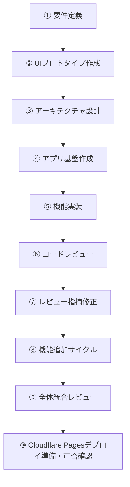
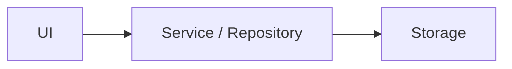
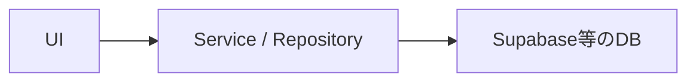

# AI開発プロンプト手順

## 1. 目的

本手順は、ChatGPT Plus / ChatGPT Workを中心に、必要に応じてCodexを利用しながら、Webアプリを効率よく開発するための標準フローを定義する。

主な目的は以下。

- AIへの指示を標準化する
- 一度に大きな実装を依頼せず、品質を安定させる
- 利用量を抑えながら必要な場面だけ高性能モデルを利用する
- HTMLプロトタイプをUI仕様として活用する
- ローカルで開発できる構成にする
- 低コストでWeb公開できる構成にする
- 将来的な機能追加やDB導入を容易にする

---

# 2. 基本方針

AI開発では、以下の順番を守る。



### 制約

`このHTMLを参考にアプリ全体を完成させてください。`のような丸投げの指示はしないこと

一度に多数の責務をAIへ渡さず、1タスクごとに明確なスコープと完了条件を設定する。

### 利用環境の基本方針

```text
プラン          ：ChatGPT Plus
要件・設計      ：ChatGPT Plus
実装・テスト    ：ChatGPT Work（デスクトップ）
機能サイクル管理・難しい開発作業：Codex
Web公開先       ：Cloudflare Pages
本手順の完了地点：Cloudflare Pagesへデプロイ可能と確認できた状態
```

---

# 3. AIへ渡す情報

HTMLだけを仕様として利用しない。

プロジェクトでは最低限、以下を管理する。

```text
project/
├─ AGENTS.md
│
├─ doc/
│  ├─ requirements.md -- 機能要件・MVP範囲のSource of Truth
│  ├─ architecture.md -- 実装方式・責務分離・データ構造のSource of Truth
│  └─ ui-reference.html -- UI・画面表現・操作イメージのSource of Truth
│
├─ .agents/
│  ├─ README.md
│  │
│  ├─ roles/
│  │  ├─ orchestrator.md
│  │  ├─ planner.md
│  │  ├─ builder.md
│  │  ├─ reviewer.md
│  │  ├─ fixer.md
│  │  ├─ finalizer.md
│  │  └─ release-auditor.md
│  │
│  ├─ skills/
│  │  ├─ orchestrate-feature-cycle/
│  │  │  └─ SKILL.md
│  │  ├─ plan-feature-change/
│  │  │  └─ SKILL.md
│  │  ├─ foundation/
│  │  │  └─ SKILL.md
│  │  ├─ implement-feature/
│  │  │  └─ SKILL.md
│  │  ├─ review-feature/
│  │  │  └─ SKILL.md
│  │  ├─ fix-review/
│  │  │  └─ SKILL.md
│  │  ├─ finalize-task/
│  │  │  └─ SKILL.md
│  │  ├─ integration-review/
│  │  │  └─ SKILL.md
│  │  └─ deploy-readiness/
│  │     └─ SKILL.md
│  │
│  ├─ tasks/
│  │  ├─ TEMPLATE.md
│  │  ├─ 001-foundation.md
│  │  ├─ 002-learning-history.md
│  │  └─ 003-sort-visualizer.md
│  │
│  └─ reviews/
│     └─ TEMPLATE.md
│
├─ .codex/
│  ├─ config.toml
│  └─ agents/
│     ├─ planner.toml
│     ├─ builder.toml
│     ├─ reviewer.toml
│     ├─ fixer.toml
│     ├─ finalizer.toml
│     ├─ release-auditor.toml
│     └─ workflow-analyst.toml
│
├─ src/ -- 現在の実装状態
├─ package.json
└─ README.md -- 開発・起動方法
```

AIへ指示するときは可能な限り以下をコンテキストとして利用する。

```text
要件
+
設計
+
UI仕様
+
現在のコード
+
今回実施する内容
```

資料間に矛盾がある場合は、AIが勝手に解釈して実装を進めない。矛盾箇所を報告し、要件に関わる判断が必要な場合は確認事項として提示する。

### Candidate Referenceの扱い

機能ごとに作成したHTML、モック、メモ、参考実装等は、
Source of TruthではなくCandidate Referenceとして扱う。

Candidate Referenceからは、

- 画面要素
- 操作
- 状態変化
- 説明内容
- 実装候補

を抽出してよい。

ただし、Source of Truthと異なる内容を自動採用しない。
相違点を質問し、ユーザーが採用を確定した後に、
責務を持つSource of Truthへ反映する。

### RoleとCodex Custom Agentの使い分け

ChatGPT Workでは、`.agents/roles/*.md` を
プロンプトから明示的に指定する。

Codexでは、`.codex/agents/*.toml` の
カスタムエージェントへ対象作業を明示的に委譲する。

1つの機能変更を計画から完了まで進める場合は、
各工程でCodexのメインスレッドを親Orchestratorとして使用する。
Orchestratorは `.codex/agents` の子エージェントではない。

```text
orchestrator    → メインスレッドとしてRole間の状態遷移とユーザー対話を管理
planner         → 機能変更計画、Source of Truth更新、Task準備
builder         → Ready Taskの実装
reviewer        → 機能レビュー
fixer           → Critical / High修正
finalizer       → 最終Review・test・build確認後のTask完了確定
release_auditor → 統合・デプロイ可否レビュー
workflow_analyst → Codex専用の読み取り専用調査
```

`workflow_analyst`は対応するRoleファイルを持たないCodex専用Custom Agentである。
それ以外のCustom Agentは、対応するRoleを起動する薄い設定レイヤーとして扱う。

`.agents/skills/*/SKILL.md` と `.agents/tasks/*.md` は、
WorkとCodexの両方で共通の作業手順・要求として利用する。

Codexへ委譲する場合の基本形：

```text
AGENTS.mdを確認してください。

カスタムエージェント[agent-name]に、
以下のSkillとTaskに従う作業を委譲してください。

Skill:
.agents/skills/[skill-name]/SKILL.md

Task:
.agents/tasks/[task].md

対象エージェントの完了を待ち、
結果をAGENTS.mdの形式で統合して報告してください。
```

上記は単独工程を手動実行する場合の基本形である。

本手順のPhase 8では、Codexのメインスレッドを親Orchestratorとし、
Goal modeと`orchestrate-feature-cycle` Skillで1つの機能サイクルを管理する。

状態遷移、並列実行、停止・再開条件、完了GateはSkillを正本とする。
書き込み可能なRoleを同時に起動しない。
独立した読み取り専用調査が有効な場合だけ、
`workflow_analyst`を選択したSkillの上限内で使用する。

---

# 4. 推奨技術構成

MVPでは以下を基本構成とする。

```text
Node.js LTS / npm
Vite
Vue 3
TypeScript
Vue Router（複数画面を持つ場合）
CSS
Vitest
Cloudflare Pages（Web公開先）
```

初期段階では原則として以下を導入しない。

- 独自バックエンド
- 認証
- DB
- Docker
- AWS等の複雑なクラウド構成
- Pinia等のグローバル状態管理ライブラリ（必要性が明確になるまでは導入しない）
- マイクロサービス

ローカルでは以下で起動できる状態を維持する。

```bash
npm install
npm run dev
```

本番用ビルドは以下。

```bash
npm run build
```

テストと本番ビルドのローカル確認は、以下のコマンドを利用できる状態を基本とする。

```bash
npm run test
npm run preview
```

`npm run test` はCIやAI実行でも終了するよう、Vitestのwatchモードではなく1回実行（`vitest run`）を基本とする。`npm run preview` は本番ビルドの表示確認後に停止する。

---

# 5. データ保存方針

MVPでは可能であれば以下を利用する。

- localStorage
- IndexedDB

ただしUIから直接localStorage等を操作しない。



将来的に以下のような置き換えができる構造とする。



---

# 6. モデル選択ルール

本手順はChatGPT Plusを前提とする。

利用量を抑えるため、すべての作業で最高性能のモデル・推論設定を利用しない。利用する環境によって選択肢が異なるため、通常のChatGPTとChatGPT Workを分けて考える。Codexは親Orchestratorによる機能サイクル管理、またはWorkで解決困難な作業に利用する。

## ChatGPTでの選択

要件整理、UI検討、アーキテクチャ設計など、リポジトリを直接編集しない作業で利用する。

```text
軽い整理・文言修正 → Instant
通常の要件整理・UI検討 → Medium
重要な設計・難しいレビュー → High
```

ChatGPT PlusではInstant / Medium / Highを基本的な選択肢とする。PlusではProを前提にしない。通常作業では必要以上にHighを選ばず、Mediumを基本とする。

## ChatGPT Workでの選択

ローカルファイルやリポジトリを扱う実装・テスト・レビューでは、ChatGPTデスクトップアプリのWorkを基本環境とする。

```text
軽微な修正・単純作業 → GPT-5.6 Luna
通常の実装・テスト・修正 → GPT-5.6 Terra
複雑な設計判断・難しいバグ解析・重要レビュー → GPT-5.6 Sol
```

基本的な開発ではGPT-5.6 Terraをデフォルトとし、GPT-5.6 Lunaは単純作業、GPT-5.6 Solは品質上の効果が大きい場面に限定する。

## Codexを利用する条件

Codexは、PlanからFinalizeまでを親Orchestratorが少ないユーザー指示で管理する場合、
またはChatGPT Workでの対応が難しい場合に利用する。

主な利用例：

- PlannerからFinalizerまでをGateに従って順次委譲する場合
- Planner調査、重要レビュー、統合レビューを限定的に並列化する場合
- 原因の切り分けが難しいバグを、リポジトリ・ターミナル・開発ツールを横断して調査する場合
- 広範囲のコード変更や複雑なリファクタリングが必要な場合
- Workで複数回修正してもテストやビルドが安定しない場合
- コードベース全体を対象とする専門的な実装・デバッグ作業が必要な場合

Codexを利用する場合も、モデル選択はWorkと同様に、通常はGPT-5.6 Terra、難しい問題のみGPT-5.6 Solを基本とする。並列サブエージェントは使用量が増えるため、小規模で明確なTaskでは利用しない。

---

# 7. プロンプト基本フォーマット

原則としてすべての開発プロンプトを以下の構成で作成する。

```text
# 目的

今回達成したいこと

# コンテキスト

関連する要件・設計・既存機能

# 今回のスコープ

今回実施する内容

# スコープ外

今回変更・実装しない内容

# 制約

技術・設計・UI等の制約

# 完了条件

□ 条件1
□ 条件2
□ 条件3

# 作業後の報告

1. 変更内容
2. 変更ファイル
3. テスト結果
4. 未解決事項
```

---

# 8. Phase 1：要件定義

## 目的

実装前にMVPの範囲とアプリの責務を決める。

## 推奨モデル

```text
ChatGPT Medium
```

要件間のトレードオフやMVP範囲の判断が難しい場合のみHighを利用する。

## 推奨環境

```text
ChatGPT Plus
```

## プロンプト例

```md
今回の目的はWebアプリの要件定義です。

まだ実装はしないでください。

# 作りたいもの

[アプリ概要]

# 想定ユーザー

[利用者]

# 解決したい課題

[課題]

# 必要だと考えている機能

[機能一覧]

# 技術上の条件

・ローカルで開発できること
・低コストでWeb公開できること
・スマートフォンで利用できること
・将来的な機能追加がしやすいこと

# 確認してほしいこと

・MVPとして大きすぎないか
・不要な機能がないか
・機能ごとの責務が明確か
・将来的な拡張を妨げないか

# 完了条件

□ MVPが定義されている
□ 機能一覧が決まっている
□ 画面一覧が決まっている
□ 画面遷移が決まっている
□ MVP対象外が明確になっている

最後に、確定した要件をMarkdown形式でまとめてください。
```

成果物：

```text
doc/requirements.md
```

---

# 9. Phase 2：UIプロトタイプ作成

## 目的

実装前に画面構成・操作感を確認する。

HTMLは本番コードではなく、UI仕様として扱う。

## 推奨モデル

```text
ChatGPT Medium
```

複雑な画面構成や情報設計の判断が必要な場合のみHighを利用する。

## 推奨環境

```text
ChatGPT Plus
```

## プロンプト例

```md
以下の要件をもとに、
UI確認用のプロトタイプを作成してください。

# 目的

実装ではなく、

・画面構成
・情報設計
・操作性
・レスポンシブ表示
・UIの分かりやすさ

を確認することです。

# 実装形式

HTML / CSS / JavaScriptを1ファイルにまとめてください。

# 要件

[requirements.mdの内容または対象要件]

# 制約

・バックエンド不要
・DB不要
・認証不要
・ダミーデータでよい
・スマートフォン表示も考慮する

# 完了条件

□ 必要な情報が画面上に存在する
□ 基本操作を確認できる
□ PCで確認できる
□ スマートフォン幅でも破綻しない
```

成果物：

```text
doc/ui-reference.html
```

---

# 10. Phase 3：アーキテクチャ設計

## 目的

UIプロトタイプを、本番アプリへ変換するための内部設計を決める。

## 推奨モデル

```text
ChatGPT High
```

## 推奨環境

```text
ChatGPT Plus
```

## プロンプト例

```md
添付されている要件定義とHTMLは、
これから実装するWebアプリの仕様です。

HTMLをそのまま本番コードとして利用するのではなく、
Vue 3 + TypeScript + Viteで実装するための
アーキテクチャを設計してください。

今回は設計のみです。
実装はしないでください。

# 条件

・ローカル開発可能
・Cloudflare Pagesへ静的デプロイ可能
・スマートフォン対応
・Vue 3のComposition APIを基本とする
・機能追加しやすい
・UIとロジックを分離する
・データ保存処理をUIから分離する
・将来的にDBを追加可能
・MVPではバックエンド不要
・Pinia等のグローバル状態管理は必要性が明確な場合のみ採用する
・過剰設計を避ける

# 確認事項

・MVPとして構成が大きすぎないか
・各機能の責務が明確か
・機能間の依存が強すぎないか
・将来的な追加機能に対応できるか
・不要な抽象化がないか

# 出力

1. 技術構成
2. アーキテクチャ
3. ディレクトリ構成
4. 画面構成
5. コンポーネント構成
6. データ構造
7. 状態管理方針
8. 永続化方針
9. テスト方針
10. 実装順序

# 完了条件

□ 技術構成が決まっている
□ ディレクトリ構成が決まっている
□ 各機能の責務が決まっている
□ データ構造が決まっている
□ 状態管理方法が決まっている
□ 実装順序が決まっている

最後に確定した設計をMarkdown形式で出力してください。
```

成果物：

```text
doc/architecture.md
```

---

# 11. Phase 4：アプリ基盤作成

## 目的

機能を実装する前に、最低限のアプリケーション基盤だけを作る。

## 推奨モデル

```text
GPT-5.6 Terra
```

基盤構成が複雑、またはarchitecture.mdからの実装判断が難しい場合のみGPT-5.6 Solを利用する。

## 推奨環境

```text
基本：ChatGPT Work（デスクトップでローカルフォルダを使用）
必要時のみ：Codex（デスクトップ）
```

Codexは、Workでの実装・テスト・原因調査で解決できない場合に限って利用する。

## プロンプト例

```text
AGENTS.mdを確認してください。

今回はBuilderとして作業してください。

Role:
.agents/roles/builder.md

Skill:
.agents/skills/foundation/SKILL.md

Task:
.agents/tasks/001-foundation.md

上記と必要なSource of Truthを読んでから、
Taskの範囲だけ実装してください。

Task外の実装や設計変更は行わないでください。

完了後はAGENTS.mdで指定された形式だけ報告してください。
```

---

# 12. Phase 8：機能追加を繰り返す

## 目的

機能の追加・変更・削除ごとに、実装前の計画Gateを通し、
次の状態遷移を完了する。

```text
Plan
→ Build
→ Review
→ 必要な場合のみFix
→ Re-review
→ Finalize
```

Codexでは`.agents/skills/orchestrate-feature-cycle/SKILL.md`を
この状態遷移、並列実行、停止・再開条件、完了GateのSource of Truthとする。
プロンプト内へ同じ規則を再掲しない。

## 実行環境

```text
全体サイクル：Codexのメインスレッド + Goal mode
各工程の手動実行：ChatGPT Work
```

Codexのメインスレッドが親Orchestratorを担当する。
`orchestrator`カスタムエージェントは作成しない。

各工程は次のカスタムエージェントへ委譲する。

```text
Plan       → planner
Build      → builder
Review     → reviewer
Fix        → fixer
Finalize   → finalizer
```

独立した読み取り専用調査が有効な場合だけ、
`workflow_analyst`をSkillの上限内で使用する。

## Source of Truth更新判定

| 変更内容                                                     | 更新候補                |
| ------------------------------------------------------------ | ----------------------- |
| MVP範囲、機能要件、画面責務、学習体験、完了条件              | `doc/requirements.md`   |
| 画面構成、情報配置、操作、レスポンシブ表示、見せ方           | `doc/ui-reference.html` |
| 実装方式、責務分離、データ構造、状態管理、永続化、テスト方針 | `doc/architecture.md`   |
| 上記を変えない実装詳細だけ                                   | Source of Truth変更なし |

Candidate Referenceは仕様ではない。
差分を質問し、ユーザーが採用を確定した内容だけを
責務を持つSource of Truthへ反映する。

更新順序は原則として次のとおりとする。

1. `requirements.md`で機能・範囲を確定する
2. UI変更がある場合は`ui-reference.html`へ反映する
3. 実装設計変更がある場合は`architecture.md`へ反映する
4. 最後にTaskを作成または更新する

Source of Truthを変更しない場合も、Taskの`Source of Truth Impact`へ理由を書く。

## Task Gate

同じ目的の既存Taskがある場合は重複作成しない。
新しいTaskは原則として`Blocked`から開始する。

Taskを`Ready`にできるのは、次をすべて満たす場合だけとする。

- 重要なOpen Decisionsがない
- 依存Taskがすべて`Done`
- 必要なSource of Truth更新が完了している
- 資料間に実装判断へ影響する矛盾がない
- Scope、Out of Scope、Allowed Changes、Acceptance Criteriaが明確である

Taskを`Done`にできるのは、`finalize-task` Skillの完了Gateを
すべて満たした場合だけとする。

## Codex用：推奨Goalプロンプト

1機能を計画から完了確定まで進める場合は、次を1回送る。

プロンプトを投げる前に、変更要求の内容自体をAIに考えてもらう。

```text
/goal

$orchestrate-feature-cycle を使用し、
次の機能変更を計画GateからTask完了確定まで進めてください。

変更要求:
[追加・変更・削除したい内容]

Candidate Reference:
[参照。なければ「なし」]

対応する既存Task:
[Taskパス。未確定なら「親が確認」]

重要なユーザー判断が必要な場合は、
質問を重複排除して提示し、回答を受けるまで停止してください。

完了条件:
- 対象TaskがDone
- Completion Evidenceが記録されている
- 最新Reviewが現在の実装を対象としている
- 最新ReviewがNext step: proceedで終了している
- npm run testとnpm run buildが成功している

push、PR作成、merge、deployは行わないでください。
```

このプロンプトでは、Goal modeが継続目標を保持し、
`orchestrate-feature-cycle` Skillが実行手順を定義する。

## ユーザー回答後の再開

質問へ回答する場合は、同じCodexチャットで次を送る。

```text
前回の質問への確定回答です。

[確定回答]

同じGoalを停止したGateから再開してください。
```

回答後に変更要求、Skill全文、完了条件を再掲する必要はない。

<details>

<summary>Codex用：Planだけで停止する場合</summary>

Source of TruthとTaskの準備だけを行う場合は、通常のCodexプロンプトで
カスタムエージェント名と停止地点を明示する。

```text
AGENTS.mdを確認してください。

カスタムエージェントplannerへ、
$plan-feature-change に従って次の変更要求の計画を委譲してください。

変更要求:
[追加・変更・削除したい内容]

Candidate Reference:
[参照。なければ「なし」]

未確定事項があれば質問を返して停止してください。
回答確定後は必要なSource of TruthとTaskだけを更新し、
TaskがReadyまたはBlockedになった時点で停止してください。
アプリケーションコードは変更しないでください。
```

Roleパスだけではなく、`planner`というカスタムエージェント名を明示する。

</details>

<details>

<summary>ChatGPT Workで工程を手動実行する場合</summary>

Workでは対象Role、Skill、TaskまたはCandidate Referenceを明示する。

### Plan：差分・影響分析

```text
AGENTS.mdを確認してください。

Role:
.agents/roles/planner.md

Skill:
.agents/skills/plan-feature-change/SKILL.md

Task Template:
.agents/tasks/TEMPLATE.md

次の変更要求とCandidate ReferenceをSource of Truth、既存Task、
現在のコードと比較し、未確定事項を質問してください。
この段階ではファイルを変更しないでください。

変更要求:
[変更要求]

Candidate Reference:
[参照。なければ「なし」]
```

### Plan：確定内容の反映

```text
AGENTS.mdを確認してください。

Role:
.agents/roles/planner.md

Skill:
.agents/skills/plan-feature-change/SKILL.md

前回の質問への確定回答だけを反映してください。
必要なSource of Truthを先に更新し、
その後、既存Taskを更新または新規Taskを作成してください。
TaskがReadyまたはBlockedになった時点で停止し、
アプリケーションコードは変更しないでください。

確定回答:
[確定回答]
```

### Build以降

Taskが`Ready`になった後は、Phase番号ではなく次の対応を使用する。

| 工程     | Role                         | Skill                                       | 追加コンテキスト     | 次工程                                        |
| -------- | ---------------------------- | ------------------------------------------- | -------------------- | --------------------------------------------- |
| Build    | `.agents/roles/builder.md`   | `.agents/skills/implement-feature/SKILL.md` | 対象Task             | Review                                        |
| Review   | `.agents/roles/reviewer.md`  | `.agents/skills/review-feature/SKILL.md`    | 対象Taskと現在の実装 | `proceed`ならFinalize、Critical / HighならFix |
| Fix      | `.agents/roles/fixer.md`     | `.agents/skills/fix-review/SKILL.md`        | 対象Taskと正式Review | 必ずRe-review                                 |
| Finalize | `.agents/roles/finalizer.md` | `.agents/skills/finalize-task/SKILL.md`     | 対象Taskと最新Review | Gateを満たした場合だけDone                    |

ChatGPT Workで個別工程を実行する場合は、次のテンプレートを使用する。

```text
AGENTS.mdを確認してください。

Role:
[上表のRoleパス]

Skill:
[上表のSkillパス]

Task:
.agents/tasks/[task].md

Review:
[FixまたはFinalizeの場合だけ正式Reviewパス。その他は「なし」]

上記を完全に読んでから、指定された1工程だけを実行してください。
次工程は実行せず、Skillが定義する成果物と検証結果を報告してください。
```

Fixerがアプリケーションコードを変更した場合は必ずReviewerへ戻る。
最終Reviewが`Next step: proceed`になった後、
`finalizer` Roleと`finalize-task` Skillを別工程として実行する。

## 完了条件

- [ ] Candidate ReferenceとSource of Truthを区別した
- [ ] 未確定事項をユーザーへ質問した
- [ ] 確定前にSource of TruthやTaskを変更していない
- [ ] 必要なSource of Truthだけを更新した
- [ ] 対応するTaskを新規作成または更新した
- [ ] 既存Taskを重複作成していない
- [ ] TaskのStatusがGateに従っている
- [ ] TaskがReadyになるまで実装していない
- [ ] Codexでは`orchestrate-feature-cycle` Skillを使用した
- [ ] 各工程を対応するCustom Agentへ委譲した
- [ ] 並列実行はSkillが許可する読み取り専用調査だけである
- [ ] 書き込み可能なRoleを同時実行していない
- [ ] Fixerがコードを変更した場合にReviewerを再実行した
- [ ] 最新Reviewが現在の実装を対象としている
- [ ] 最新Reviewが`Next step: proceed`で終了している
- [ ] `npm run test`が成功した
- [ ] `npm run build`が成功した
- [ ] Finalizerが完了Gateを確認した
- [ ] TaskがDoneになり、Completion Evidenceが記録された

</details>

---

# 13. Phase 9：全体統合レビュー

## 目的

すべてのMVP機能が完成した段階で、アプリ全体が要件・設計に沿って統合され、リリース可能な状態か確認する。

統合レビューの並列上限、書き込み境界、統合方法は
`integration-review` SkillをSource of Truthとする。
最後に1つのRelease Auditorが結果を検証し、Review成果物を書き込む。

## 推奨モデル

```text
GPT-5.6 Sol
```

## 推奨環境

```text
基本：ChatGPT Work（デスクトップでローカルフォルダを使用）
必要時のみ：Codex（デスクトップ）
```

## ChatGPT Work用プロンプト

```text
AGENTS.mdを確認してください。

Role:
.agents/roles/release-auditor.md

Skill:
.agents/skills/integration-review/SKILL.md

requirements.md、architecture.md、ui-reference.htmlを基準として、
現在のMVP全体をレビューしてください。
アプリケーションコードは変更しないでください。
```

## Codex用プロンプト

```text
$integration-review を使用し、
CodexのメインスレッドでMVP全体レビューを管理してください。

必要な場合だけ、カスタムエージェントworkflow_analystによる
独立した読み取り専用調査をSkillの上限内で実行してください。

調査完了後、1つのカスタムエージェントrelease_auditorへ
検証とReview成果物の作成を委譲してください。

アプリケーションコード、Source of Truth、Task、GitHub状態は
変更しないでください。
```

## NG時のCodex用プロンプト

Integration Reviewが`MVP releaseable: No`かつ`Next step: fix required`で終了した場合だけ使用する。
詳細な復帰手順は`remediate-integration-review` Skillを正本とし、ここには実行ごとに変わる入力だけを記載する。

```
/goal

$remediate-integration-review を使用し、
Phase 9のNG対応からIntegration Reviewの再通過まで進めてください。

Integration Review:
[最新のIntegration Review成果物パス、添付ファイル、または結果全文]

対象Task:
[Taskパス。Reviewから安全に特定できる場合は「Reviewから特定」]

push、PR作成、merge、deployは行わないでください。
```

`Next step: user decision required`の場合は、このプロンプトを実行せず、
Integration Reviewが示した判断を先に確定する。

---

# 14. Phase 10：Cloudflare Pagesデプロイ準備・可否確認

## 目的

MVPをCloudflare Pagesへ低コストで公開できる状態か確認する。実際のデプロイ操作はこのPhaseでは行わない。

想定構成：

```text
ローカル
↓
GitHub
↓
Cloudflare Pages
↓
Web公開（本手順ではデプロイ実行前まで）
```

## 推奨モデル

```text
GPT-5.6 Terra
```

デプロイ固有の問題や原因不明のビルドエラーがある場合のみGPT-5.6 Solを利用する。

## 推奨環境

```text
基本：ChatGPT Work（デスクトップでローカルフォルダを使用）
必要時のみ：Codex（デスクトップ）
```

## ChatGPT Work用プロンプト

```text
AGENTS.mdを確認してください。

Role:
.agents/roles/release-auditor.md

Skill:
.agents/skills/deploy-readiness/SKILL.md

Cloudflare Pagesへデプロイ可能な状態か確認してください。
実際のデプロイ、GitHubへのpush、Cloudflare側設定変更は行わないでください。
```

## Codex用プロンプト

```text
$deploy-readiness を使用し、
1つのカスタムエージェントrelease_auditorへ
Cloudflare Pagesのデプロイ可否確認を委譲してください。

実際のpush、PR作成、Cloudflare側設定変更、deployは
行わないでください。
```

---

# 15. Workで失敗した場合の修正ルール（必要時Codex）

ChatGPT Workで期待する結果が得られなかった場合、最初から作り直させない。

失敗原因に応じて修正プロンプトを使い、Workでの修正を優先する。複数回の修正でも原因特定や解決が難しい場合のみCodexへ切り替える。

---

## ケース1：変更範囲が広すぎる

```text
今回の変更範囲が要求より広くなっています。

既存機能への不要な変更を取り消し、
以下だけを変更してください。

# 変更対象

[対象]

# 変更禁止

[対象外]

今回の目的達成に必要な最小変更にしてください。

完了後、
変更したファイル一覧と理由だけ報告してください。
```

---

## ケース2：勝手に設計変更された

```text
現在の実装はarchitecture.mdの設計から逸脱しています。

architecture.mdをSource of Truthとして、
今回追加した部分のみ設計に合わせて修正してください。

architecture.md自体は変更しないでください。

設計変更が必要だと判断した場合も、
勝手に変更せず理由だけ報告してください。
```

---

## ケース3：機能は動くがコードが複雑

```text
現在の機能仕様は変更せず、
今回追加したコードだけレビューしてください。

以下を重点的に確認してください。

・不要な抽象化
・重複コード
・責務の混在
・巨大なコンポーネント
・過剰な状態管理

改善が必要な場合も、
まず修正案だけ提示してください。

今回はまだコードを変更しないでください。
```

---

## ケース4：UIがHTMLと違う

```text
機能自体は変更せず、
UIを添付HTMLに近づけてください。

添付HTMLはUI仕様として扱ってください。

# 今回変更してよいもの

・レイアウト
・CSS
・表示要素
・レスポンシブ対応

# 変更してはいけないもの

・ビジネスロジック
・データ構造
・既存API
・既存テストの仕様

完了後、UI関連で変更した内容のみ報告してください。
```

---

## ケース5：バグが直らない

この段階で高推論モデルへ切り替える。

```text
以下のバグについて原因分析をしてください。

まだコードは変更しないでください。

# 現象

[バグ内容]

# 再現手順

1.
2.
3.

# 期待動作

[期待結果]

# 実際の動作

[実際の結果]

# 調査してほしいこと

1. 根本原因
2. 関連するファイル
3. 修正候補
4. 各候補のリスク
5. 最小変更で直す方法

推測だけで修正を始めず、
まず原因を特定してください。
```

原因確定後、別タスクで修正する。

---

# 16. プロンプト設計ルール

AIへの指示では以下を優先する。

## 推奨

```text
目的
コンテキスト
スコープ
スコープ外
制約
完了条件
出力形式
```

## 必要に応じて利用

- 良い出力例
- 悪い出力例
- 変更可能ファイル
- 変更禁止ファイル
- テスト方法

## 原則不要

```text
あなたは世界最高のエンジニアです。
```

のような役割演出。

また、

```text
Step 1で考えて
Step 2で考えて
Step 3で……
```

と内部思考方法を細かく指定するより、

```text
この条件を満たしてください。
```

と成果条件を明確にする。

---

# 17. 使用量を抑えるルール

## 17.1 毎回巨大なHTMLを貼らない

可能であればプロジェクト内に保存し、

```text
ui-reference.htmlを参照してください。
```

とする。

---

## 17.2 コード全文を回答させない

ChatGPT Work（または必要時のCodex）が直接リポジトリを編集できる場合は、

```text
コード全文は回答に貼らないでください。

以下のみ報告してください。

・変更ファイル
・変更概要
・テスト結果
・残課題
```

とする。

---

## 17.3 1機能ずつ処理する

悪い例：

```text
教材、問題、履歴、分析を全部実装してください。
```

良い例：

```text
今回はソート可視化だけ実装してください。
```

---

## 17.4 高性能モデルを常用しない

```text
ChatGPT Plusでの軽い整理 → Instant
ChatGPT Plusでの通常相談 → Medium
ChatGPT Plusでの重要設計 → High
ChatGPT Workでの通常実装 → GPT-5.6 Terra
ChatGPT Workでの軽微修正 → GPT-5.6 Luna
ChatGPT Workでの難しい問題・重要レビュー → GPT-5.6 Sol
Codex → 親Orchestratorによる機能サイクル管理、またはWorkで解決困難な作業
```

とする。

---

## 17.5 並列サブエージェントを常用しない

並列サブエージェントは各自がコンテキスト確認とモデル・ツール処理を行うため、
ユーザーの指示回数は減っても使用量が減るとは限らない。

小規模で明確なTaskは親と1つの担当エージェントで順次処理する。

並列化する場合は、選択したSkillの上限と分割条件に従う。
Codexの読み取り専用調査には`workflow_analyst`を使用する。
ChatGPT WorkではCodex専用Custom Agentを前提にせず、
選択したSkillが許可する場合だけ汎用の読み取り専用subagentを使用する。
同じ情報を無条件に全エージェントへ渡さない。

独立した担当範囲と必要なコンテキストだけを指定する。
書き込み作業は常に1つのRoleだけが行う。

---

# 18. 開発時の禁止事項

AIに以下を許可しない。

- 要求されていない機能追加
- 不要な大規模リファクタリング
- architecture.mdの無断変更
- requirements.mdの無断変更
- 将来機能の先回り実装
- 必要性の低いライブラリ追加
- 動作確認を行わず「完成」と判断すること
- テスト失敗を無視すること
- UIから直接永続化処理を書くこと
- 1コンポーネントへ多数の責務を集中させること

---

# 19. 推奨するプロジェクト全体フロー

```text
ChatGPT Plus
│
├─ 要件整理
│
├─ UI相談
│
└─ プロンプト作成
     │
     ▼
requirements.md
     │
     ▼
ui-reference.html
     │
     ▼
architecture.md
     │
     ▼
ChatGPT Work（手動Phase実行）
またはCodex親Orchestrator
     │
     ├─ アプリ基盤
     │
     ├─ 機能A
     │    ├─ 親が計画・質問・Source of Truth更新を管理
     │    ├─ Task準備・Ready確認
     │    ├─ 実装
     │    ├─ レビュー（重要な場合だけ読み取り調査を最大2並列）
     │    ├─ 必要なら修正・再レビュー
     │    └─ FinalizerによるDone確定
     │
     ├─ 機能B
     │    ├─ 親が計画・質問・Source of Truth更新を管理
     │    ├─ Task準備・Ready確認
     │    ├─ 実装
     │    ├─ レビュー（重要な場合だけ読み取り調査を最大2並列）
     │    ├─ 必要なら修正・再レビュー
     │    └─ FinalizerによるDone確定
     │
     ├─ 機能C
     │    ├─ 親が計画・質問・Source of Truth更新を管理
     │    ├─ Task準備・Ready確認
     │    ├─ 実装
     │    ├─ レビュー（重要な場合だけ読み取り調査を最大2並列）
     │    ├─ 必要なら修正・再レビュー
     │    └─ FinalizerによるDone確定
     │
     ▼
統合レビュー（読み取り調査を最大3並列）
     │
     ▼
npm run build
     │
     ▼
GitHub
     │
     ▼
Cloudflare Pages
デプロイ可否確認
     │
     ▼
手順完了
```

---

# 20. 最重要ルール

AI開発では、

```text
良いプロンプトを1回作る
```

ことより、

```text
要件
↓
設計
↓
Task準備
↓
実装
↓
レビュー
↓
必要なら修正・再レビュー
↓
テスト
↓
Finalizerによる完了確定
```

という工程を守ることを優先する。

Phase 8では、CodexのGoal modeで`orchestrate-feature-cycle` Skillを使用し、
親Orchestratorが各Roleを状態遷移に従って委譲する。
選択したSkillのGateを満たした場合だけ次へ進む。

また、1回のプロンプトでは、

> 「今回何を完成させればよいか」

を明確にし、

> 「今回何をしてはいけないか」

も同時に指定する。

この2つをすべての開発タスクで共通ルールとする。
