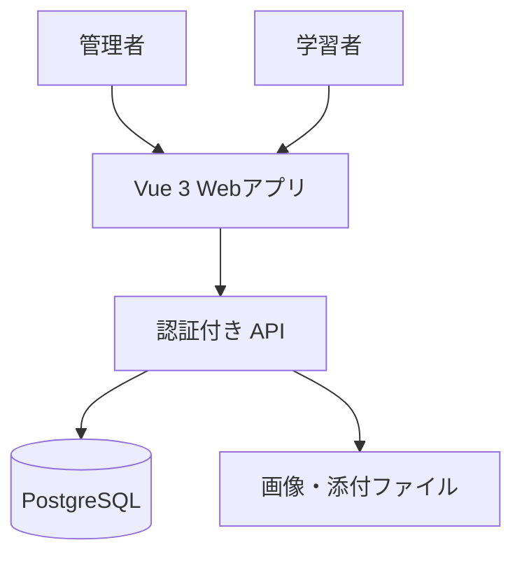
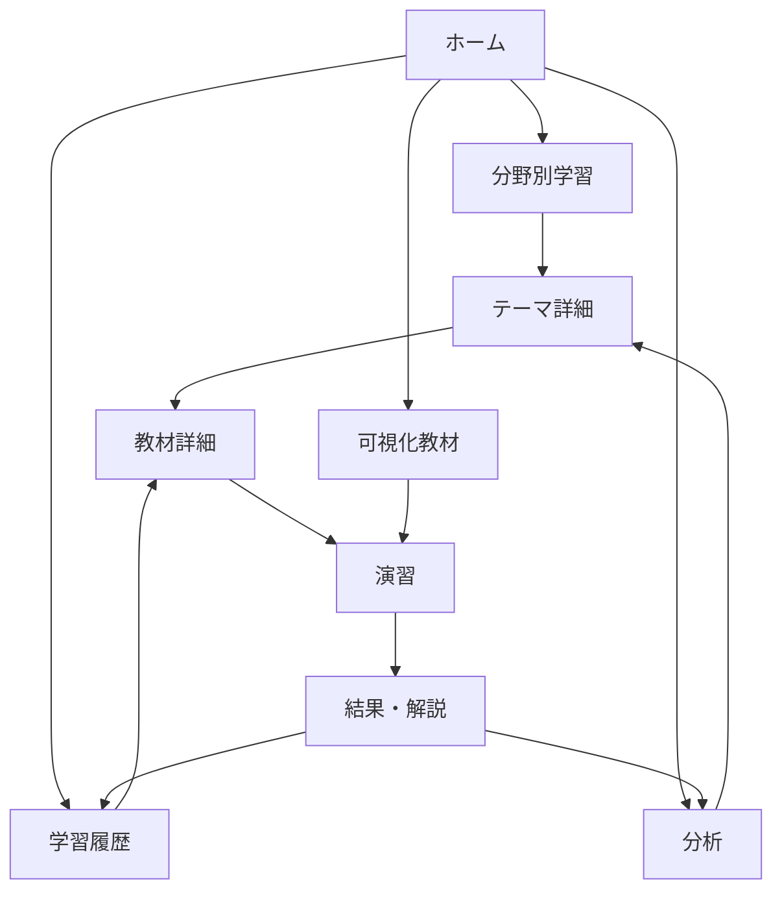
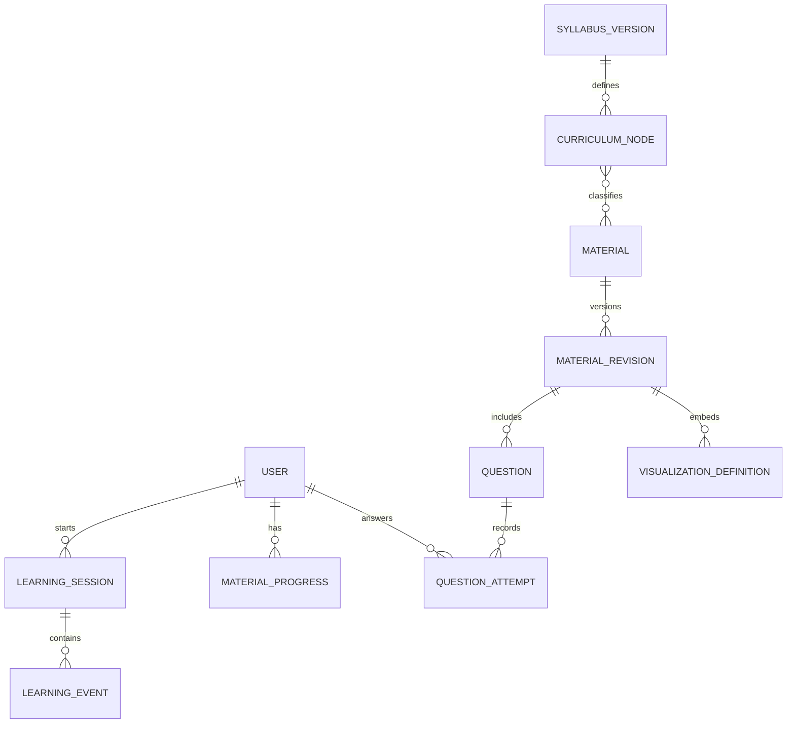

# 応用情報技術者試験 学習Webアプリ 設計書

作成日: 2026-08-30  
対象: 学習者向けWebアプリ（PC・スマートフォン対応）

## 1. 設計の前提と方針

### 合意した前提

- 学習履歴はアカウント単位で保存し、管理者が学習者を管理できる。
- 教材は管理画面から登録・編集・公開する。
- 利用者画面では「科目A／科目B」を主軸にせず、**学習テーマ・理解目標・演習形式**で学習を導く。
- 初期の可視化教材には、既存方針の**ソート可視化**を含める。
- フロントエンドは Vue 3 + TypeScript + Vite を前提とする。

### コンテンツの基準

教材の分類は、IPAの「応用情報技術者試験（レベル3）シラバス Ver.7.2」の階層を基準にします。シラバスは技術動向に応じて見直されるため、分類そのものをUIに埋め込まず、**シラバス版を持つデータ**として管理します。

- 3系統: テクノロジ系／マネジメント系／ストラテジ系
- 9大分類、23中分類、小分類・学習目標
- 参照: [IPA 試験要綱・シラバス](https://www.ipa.go.jp/shiken/syllabus/gaiyou.html)、[シラバス Ver.7.2](https://www.ipa.go.jp/shiken/syllabus/omgdg50000005kq5-att/syllabus_ap_ver7_2.pdf)

2026年度から試験方式がCBTへ移行し、今後の制度変更も予定されているため、問題や教材に特定の試験区分名を固定しません。演習に必要な違いは `interactionMode`（選択式、記述式、ケース問題など）として持たせます。

### 設計原則

1. **「なぜ」を先に見せる。** 正誤だけで終わらせず、根拠、図、途中状態、誤答しやすい理由を教材の標準ブロックにする。
2. **教材データとUIロジックを分離する。** Vueコンポーネントに問題文・解説・分野名を直接書かない。
3. **履歴はイベントとして保存する。** 集計値を唯一の正とせず、学習イベントから履歴・分析を再計算できるようにする。
4. **公開済み教材は版管理する。** 学習済みの結果が、後の教材修正で壊れないよう、回答時点の教材版・問題版を記録する。
5. **PCとスマートフォンで画面を分けない。** 同じルート・同じ業務コンポーネントを、レイアウトだけレスポンシブに変える。

---

## 2. 全体アーキテクチャ



### 責務分担

| 層 | 責務 | 主な技術・考え方 |
| --- | --- | --- |
| Vueアプリ | 画面表示、入力、教材の描画、可視化の操作 | Vue 3、TypeScript、Vue Router、Pinia |
| API | 認証・権限、教材公開、履歴登録、集計取得 | REST APIを推奨。画面からDBへ直接接続しない |
| DB | ユーザー、教材版、学習イベント、集計データ | PostgreSQLなどのRDB |
| ファイル保管 | 教材画像、図、添付資料 | オブジェクトストレージ |

### 役割（RBAC）

| 役割 | 利用範囲 |
| --- | --- |
| `learner` | 学習、可視化教材、本人の履歴・分析 |
| `content_editor` | 下書き教材の作成・編集・プレビュー（将来追加可） |
| `admin` | 教材の公開、ユーザー管理、全体の集計確認 |

MVPでは `learner` と `admin` を実装対象にします。クラス・担当講師ごとの閲覧範囲は将来機能に分離します。

---

## 3. 画面一覧

### 学習者画面

| 画面 | ルート例 | 目的 | MVPの主要要素 |
| --- | --- | --- | --- |
| ホーム | `/` | 今日の学習を迷わず始める | 次にやる教材、連続学習日数、分野別進捗、可視化教材への導線 |
| 分野別学習 | `/learn` | 分野・テーマから教材を選ぶ | 3系統のタブ、階層ツリー、検索、進捗、未学習・復習フィルタ |
| テーマ詳細 | `/learn/topics/:topicId` | 1テーマの学習順序を把握する | 学習目標、前提知識、教材一覧、チェック問題、完了状況 |
| 教材詳細 | `/materials/:materialId` | 説明・図・例題で理解する | ステップ式教材、用語、図解、理解チェック、進捗保存 |
| 演習・結果 | `/practice/:sessionId` | 理解を確認し、根拠を学ぶ | 解答、即時フィードバック、正解理由、誤答理由、次の教材提案 |
| 可視化教材一覧 | `/visualizations` | 動かせる教材を探す | テーマ、所要時間、難易度、進捗を持つカード一覧 |
| 可視化教材詳細 | `/visualizations/:visualizationId` | 状態変化を見て仕組みを理解する | 操作、状態説明、変数表示、フローチャート、確認問題 |
| 学習履歴 | `/history` | いつ何をしたか振り返る | 日別カレンダー、セッション一覧、教材・問題の履歴 |
| 分析画面 | `/analysis` | 得意・苦手と次の行動を知る | 分野別正答率、学習時間、苦手テーマ、推奨学習 |
| サインイン | `/sign-in` | アカウントに紐付けて学習する | ログイン、初回プロフィール設定 |

### 管理者画面

| 画面 | ルート例 | 目的 | MVPの主要要素 |
| --- | --- | --- | --- |
| 管理ダッシュボード | `/admin` | 運用状況を確認する | 学習者数、公開教材数、最近の学習量 |
| 教材管理 | `/admin/materials` | 教材を作成・編集・公開する | 一覧、下書き、プレビュー、公開状態、版履歴 |
| 教材エディタ | `/admin/materials/:materialId/edit` | ブロック単位で教材を作る | 説明・図・演習・可視化埋込みの編集、分野ひも付け、入力検証 |
| 分類管理 | `/admin/curriculum` | シラバス階層と教材の対応を管理する | 版、階層、教材の関連付け |
| ユーザー管理 | `/admin/users` | 学習者を有効・無効にする | 一覧、ロール、状態、最終学習日 |

### レスポンシブ方針

| 項目 | PC | スマートフォン |
| --- | --- | --- |
| 主要ナビゲーション | 左サイドバー | 下部タブ（ホーム・学習・可視化・履歴・分析） |
| 分野ツリー | 左ペイン＋教材一覧 | 折りたたみアコーディオン＋検索 |
| 教材・分析 | 2カラムを許容 | 1カラム、要約カードを先に表示 |
| 可視化操作 | 横並びの操作パネル | 操作部を下部固定または折りたたみ表示 |
| タッチ操作 | マウス操作も使える | 44px以上のタップ領域、横スクロールを最小化 |

---

## 4. 画面遷移



管理者は `/admin` から「教材管理 → 編集 → プレビュー → 公開」と進みます。学習者向けの教材詳細画面は、公開済みの教材版だけを読むため、下書きが学習中の画面に混ざりません。

---

## 5. 主要機能

### 5.1 初心者向けの学習体験

- ホームに「次にやること」を1つだけ大きく提示する。
- テーマ詳細では、難しい用語より先に「このテーマで何が分かるようになるか」を表示する。
- 教材は `説明 → 図解／例 → 操作・確認 → なぜそうなるか` の順を基本とする。
- 問題の結果では、正解の説明だけでなく、各誤答がなぜ違うかを示す。
- 用語には短い定義と関連教材へのリンクを付ける。
- 初回は分野を選ばせず、既存の「ソート可視化」など、理解しやすい導入教材へ案内できる。

### 5.2 分野別学習

- シラバス階層を「系統 → 大分類 → 中分類 → テーマ」で表示する。
- 教材は複数テーマに関連付け可能にする。例: SQLの教材を「データベース」と「セキュリティ」に関連付ける。
- 進捗は `未着手 / 学習中 / 完了 / 要復習` を表示する。
- 検索対象はテーマ名、用語、教材タイトル、タグとする。

### 5.3 可視化教材

可視化教材は単なるアニメーションではなく、**操作した時点の状態と理由**を説明する教材です。

ソート可視化のMVP構成は次のとおりです。

- 配列をバーで表示し、比較中・交換中・確定済みを色分けする。
- 色の意味を常時表示する `StateLegend` を置く。
- `i`、`j`、最小値位置などの変数名と現在値を `VariableInspector` に表示する。
- 1ステップ、自動再生、一時停止、速度変更、リスタート、シャッフルを提供する。
- フローチャートは、見やすさを優先して判断・反復の意味を区別して表示する。図形が読みにくくなる場合は、説明付きの線形ステップ表示へ自動的に簡略化する。
- 各節目に「なぜこの比較をするか」の短い説明と確認問題を挟む。

新しい可視化教材は、許可済みのレンダラーキー（例: `sort-v1`）と設定データを登録して追加します。管理画面から任意のJavaScriptやVueコンポーネントを実行できる設計にはしません。

### 5.4 学習履歴・分析

- 学習開始・終了、教材の到達位置、問題回答、可視化の操作、完了をイベントとして保存する。
- 学習履歴は日別・セッション別に表示する。
- 分析では、正答率だけでなく、回答数・学習時間・最終学習日を併記する。回答が少ないテーマを「苦手」と断定しない。
- `おすすめの次の教材` は、未学習、誤答後、長期間未学習の順に優先して提示する。

### 5.5 管理・教材追加

- 管理者は教材を下書きで作成し、学習者表示と同じ見た目でプレビューしてから公開する。
- 公開時に教材版を固定し、修正後は新しい版を作る。
- 教材の変更履歴（誰が、いつ、何を公開したか）を監査ログに残す。
- ユーザーの削除は原則として論理削除または無効化とし、学習履歴との整合性を守る。

---

## 6. データ構造

### 6.1 データの3分類

| 分類 | 代表エンティティ | 特徴 |
| --- | --- | --- |
| 基準・教材データ | シラバス、テーマ、教材、問題、可視化定義 | 管理者が版管理して公開する。学習者は読み取り専用。 |
| 学習行動データ | セッション、イベント、回答、進捗 | ユーザーごとに追記する。教材版を参照する。 |
| 集計データ | テーマ習熟度、日別集計、推奨 | 行動データから再計算できる派生データ。 |

### 6.2 主要エンティティと関係



| エンティティ | 主な項目 | 用途 |
| --- | --- | --- |
| `users` | `id`, `email`, `display_name`, `status`, `created_at` | 学習者・管理者の識別 |
| `user_roles` | `user_id`, `role` | 権限管理 |
| `syllabus_versions` | `id`, `name`, `published_at`, `source_url` | シラバス改訂に対応 |
| `curriculum_nodes` | `id`, `syllabus_version_id`, `parent_id`, `node_type`, `code`, `name`, `learning_objective`, `sort_order` | 分類ツリー |
| `materials` | `id`, `slug`, `kind`, `status`, `current_revision_id` | 教材そのものの固定ID |
| `material_revisions` | `id`, `material_id`, `revision_no`, `content_schema_version`, `content`, `published_at` | 公開時点の教材内容 |
| `material_topics` | `material_id`, `curriculum_node_id`, `relation_type` | 教材と複数テーマの対応 |
| `questions` | `id`, `material_revision_id`, `interaction_mode`, `difficulty`, `content` | 教材内・演習用の問題 |
| `visualization_definitions` | `id`, `material_revision_id`, `renderer_key`, `config`, `initial_state` | 可視化の種類と設定 |
| `learning_sessions` | `id`, `user_id`, `started_at`, `ended_at`, `entry_point`, `device_type` | 1回の学習単位 |
| `learning_events` | `id`, `session_id`, `event_type`, `occurred_at`, `context` | 行動ログの原本 |
| `material_progress` | `user_id`, `material_id`, `material_revision_id`, `status`, `last_block_id`, `time_spent_sec` | 現在の進捗 |
| `question_attempts` | `id`, `user_id`, `question_id`, `question_revision_id`, `is_correct`, `answer`, `elapsed_ms` | 回答履歴 |
| `topic_mastery` | `user_id`, `curriculum_node_id`, `score`, `attempt_count`, `last_activity_at`, `calculated_at` | 分析用の派生データ |
| `audit_logs` | `actor_user_id`, `action`, `target_type`, `target_id`, `metadata`, `created_at` | 教材公開・ユーザー管理の監査 |

### 6.3 共通ルール

- 主キーは推測不能なUUIDを使う。
- 日時はUTCで保存し、表示時にユーザーのタイムゾーンへ変換する。
- 公開済み教材・問題は原則として直接上書きしない。修正は新しいリビジョンを作る。
- `learning_events` と `question_attempts` は削除ではなく、必要に応じて匿名化・保持期限を設ける。
- APIの受信データはサーバー側で検証する。クライアント側の型だけを信頼しない。

---

## 7. 教材データ構造

### 7.1 教材を「ブロック」で組み立てる

教材本文を1つの巨大なHTML文字列にせず、型付きのブロック配列で保存します。これにより、管理画面で並べ替え・追加ができ、Vue側ではブロック種別ごとに安全に描画できます。

```ts
type MaterialKind = 'lesson' | 'practice_set' | 'visualization';
type PublishStatus = 'draft' | 'review' | 'published' | 'archived';

interface Material {
  id: string;
  slug: string;
  kind: MaterialKind;
  status: PublishStatus;
  currentRevisionId: string | null;
}

interface MaterialRevision {
  id: string;
  materialId: string;
  revisionNo: number;
  contentSchemaVersion: 1;
  title: string;
  summary: string;
  learningObjectives: string[];
  prerequisiteTopicIds: string[];
  estimatedMinutes: number;
  difficulty: 1 | 2 | 3 | 4 | 5;
  blocks: ContentBlock[];
  source: ContentSource;
  publishedAt: string | null;
}

type ContentBlock =
  | ExplainBlock
  | CalloutBlock
  | DiagramBlock
  | ExampleBlock
  | GlossaryBlock
  | VisualizationBlock
  | CheckpointQuizBlock;
```

`ContentBlock` は例えば次のように定義します。

| ブロック | 主なデータ | 画面での役割 |
| --- | --- | --- |
| `ExplainBlock` | 見出し、Markdown本文 | 概念を説明する |
| `CalloutBlock` | 種別、短い要点、理由 | 「試験でのポイント」「注意」を示す |
| `DiagramBlock` | 図ID、代替テキスト、説明 | 図解を表示する |
| `ExampleBlock` | 問題状況、手順、結論 | 具体例で考え方を示す |
| `GlossaryBlock` | 用語ID群 | 初心者向けに用語を補足する |
| `VisualizationBlock` | `visualizationId`、説明、開始状態 | 動かせる教材を埋め込む |
| `CheckpointQuizBlock` | `questionIds`、合格条件 | 理解を確認する |

### 7.2 問題データ

学習者が見る表現は試験区分ではなく、問題の解き方で分けます。

```ts
type InteractionMode =
  | 'single_choice'
  | 'multiple_choice'
  | 'short_text'
  | 'case_study';

interface QuestionRevision {
  id: string;
  questionId: string;
  revisionNo: number;
  interactionMode: InteractionMode;
  stem: string;
  choices?: Choice[];
  correctAnswer: CorrectAnswer;
  explanation: string;
  misconceptionExplanations: Record<string, string>;
  topicIds: string[];
  tags: string[];
  difficulty: 1 | 2 | 3 | 4 | 5;
}

interface Choice {
  id: string;
  label: string;
  text: string;
}
```

`misconceptionExplanations` に「この選択肢を選びたくなる理由」と「どこが誤りか」を持たせることで、解説を初学者向けにできます。

### 7.3 可視化教材データ

```ts
interface VisualizationDefinition {
  id: string;
  materialRevisionId: string;
  rendererKey: 'sort-v1' | 'graph-v1' | 'network-v1';
  rendererVersion: number;
  config: Record<string, unknown>;
  initialState: Record<string, unknown>;
  checkpoints: VisualizationCheckpoint[];
}

interface VisualizationCheckpoint {
  id: string;
  trigger: 'step' | 'completed';
  title: string;
  explanation: string;
  questionIds: string[];
}
```

`rendererKey` はVueアプリ内のレジストリに限定します。例えば `sort-v1` は `SortVisualizationRenderer.vue` に対応させます。教材管理画面が保存できるのは設定値だけであり、任意コードの実行は許可しません。

### 7.4 出典・権利情報

教材と問題には、作成者・出典・利用条件を必ず保持します。

```ts
interface ContentSource {
  sourceType: 'original' | 'official_reference' | 'licensed' | 'adapted';
  title: string;
  url?: string;
  licenseNote?: string;
  attribution?: string;
}
```

IPAの過去問題などを扱う場合は、転載可否・出典表記・利用条件を確認した上で登録します。MVPは独自作成問題と公式ページへの参照リンクを中心にするのが安全です。

---

## 8. 学習履歴データ構造

### 8.1 原本はイベント、表示は集計

```ts
type LearningEventType =
  | 'session_started'
  | 'material_opened'
  | 'block_viewed'
  | 'visualization_operated'
  | 'question_answered'
  | 'material_completed'
  | 'session_ended';

interface LearningSession {
  id: string;
  userId: string;
  entryPoint: 'home' | 'learn' | 'visualization' | 'history' | 'analysis';
  deviceType: 'mobile' | 'desktop' | 'tablet' | 'unknown';
  startedAt: string;
  endedAt: string | null;
}

interface LearningEvent {
  id: string;
  sessionId: string;
  userId: string;
  type: LearningEventType;
  occurredAt: string;
  materialRevisionId?: string;
  topicId?: string;
  context: Record<string, unknown>;
}

interface QuestionAttempt {
  id: string;
  userId: string;
  sessionId: string;
  questionRevisionId: string;
  topicIds: string[];
  answer: Record<string, unknown>;
  isCorrect: boolean | null;
  elapsedMs: number;
  answeredAt: string;
}

interface MaterialProgress {
  userId: string;
  materialId: string;
  materialRevisionId: string;
  status: 'not_started' | 'in_progress' | 'completed' | 'review';
  lastBlockId: string | null;
  timeSpentSec: number;
  completedAt: string | null;
  updatedAt: string;
}
```

### 8.2 分析用の派生データ

| 派生データ | 算出例 | 使う画面 |
| --- | --- | --- |
| 日別学習量 | セッション・イベントから学習秒数を集計 | ホーム、履歴 |
| テーマ習熟度 | 正答率、回答数、直近性、教材完了を重み付け | 分析、分野別学習 |
| 要復習フラグ | 誤答直後、一定期間未学習、習熟度低下 | ホーム、分析 |
| 推奨教材 | 要復習・前提未達・未学習を順に評価 | ホーム、分析 |

習熟度のスコアは「推定値」です。画面には `回答数` と `最終学習日` を併記し、少ないデータで断定しない表現にします。

---

## 9. Vue.js のディレクトリ構成

Vue 3では、画面単位・機能単位・ドメイン単位を混ぜないことが重要です。以下は、`app / pages / widgets / features / entities / shared` を使う構成です。

```text
src/
├── app/
│   ├── App.vue
│   ├── main.ts
│   ├── router/
│   │   ├── index.ts
│   │   └── routes.ts
│   ├── providers/
│   │   ├── auth.ts
│   │   └── pinia.ts
│   └── styles/
│       ├── tokens.css
│       └── global.css
├── pages/
│   ├── home/HomePage.vue
│   ├── learn/LearnPage.vue
│   ├── learn/TopicPage.vue
│   ├── material/MaterialPage.vue
│   ├── practice/PracticePage.vue
│   ├── visualizations/VisualizationsPage.vue
│   ├── visualizations/VisualizationDetailPage.vue
│   ├── history/HistoryPage.vue
│   ├── analysis/AnalysisPage.vue
│   ├── auth/SignInPage.vue
│   └── admin/
│       ├── AdminDashboardPage.vue
│       ├── MaterialAdminPage.vue
│       ├── MaterialEditorPage.vue
│       ├── CurriculumAdminPage.vue
│       └── UserAdminPage.vue
├── widgets/
│   ├── app-shell/
│   ├── home-dashboard/
│   ├── curriculum-browser/
│   ├── material-reader/
│   ├── visualization-player/
│   ├── history-timeline/
│   ├── analysis-dashboard/
│   └── admin-shell/
├── features/
│   ├── auth/
│   ├── select-learning-path/
│   ├── resume-material/
│   ├── answer-question/
│   ├── record-learning-event/
│   ├── control-visualization/
│   ├── filter-curriculum/
│   ├── manage-material/
│   ├── publish-material/
│   └── manage-user/
├── entities/
│   ├── user/
│   ├── curriculum/
│   ├── material/
│   ├── question/
│   ├── visualization/
│   ├── learning-session/
│   └── analytics/
├── shared/
│   ├── api/
│   │   ├── http.ts
│   │   └── api-error.ts
│   ├── config/
│   ├── constants/
│   ├── lib/
│   ├── types/
│   ├── ui/
│   │   ├── BaseButton.vue
│   │   ├── BaseCard.vue
│   │   ├── BaseDialog.vue
│   │   ├── BaseEmptyState.vue
│   │   └── BaseProgress.vue
│   └── utils/
└── assets/
    └── icons/
```

### 配置ルール

| 層 | 入れるもの | 入れないもの |
| --- | --- | --- |
| `pages` | ルートと画面の組み立て | API呼び出しの詳細、複雑な業務ロジック |
| `widgets` | 複数機能を組み合わせた画面の大きな領域 | アプリ全体で使う小さなボタン |
| `features` | 回答、公開、検索などユーザーの行為 | 画面固有だけの装飾 |
| `entities` | 型、APIマッパー、ドメイン表示部品 | ルート依存の処理 |
| `shared` | 汎用UI、HTTP、定数、ユーティリティ | 教材本文、分野固有のロジック |

教材の実データはフロントエンドの `src/` に置かず、API側の公開済みデータを読む構成にします。`src/` に置くのは、開発用fixtureと型・バリデーション定義だけです。

---

## 10. コンポーネント構成

### 共通レイアウト

```text
AppShell
├── AppHeader
├── DesktopSideNav
├── MobileBottomNav
├── AppMain
└── GlobalFeedbackRegion
```

`DesktopSideNav` と `MobileBottomNav` は同じルート情報を使い、画面幅で切り替えます。各ページは端末ごとに複製しません。

### 画面別の主要コンポーネント

| 画面 | 主なコンポーネント |
| --- | --- |
| ホーム | `NextStudyCard`, `ProgressSummary`, `LearningStreak`, `QuickStartCard` |
| 分野別学習 | `CurriculumTree`, `CurriculumFilter`, `TopicProgressCard`, `MaterialCard` |
| 教材詳細 | `MaterialReader`, `ContentBlockRenderer`, `GlossaryDrawer`, `CheckpointQuiz`, `LearningProgressBar` |
| 演習 | `QuestionPanel`, `ChoiceList`, `AnswerFeedback`, `MisconceptionExplanation`, `PracticeResultSummary` |
| 可視化教材 | `VisualizationPlayer`, `VisualizationControlBar`, `StateLegend`, `VariableInspector`, `FlowchartPanel`, `CheckpointPanel` |
| 学習履歴 | `HistoryCalendar`, `LearningTimeline`, `SessionCard`, `HistoryFilter` |
| 分析 | `MasterySummary`, `TopicMasteryChart`, `WeakTopicList`, `RecommendedStudyCard` |
| 教材管理 | `MaterialTable`, `MaterialEditor`, `BlockEditor`, `CurriculumMapper`, `MaterialPreview`, `PublishDialog` |
| ユーザー管理 | `UserTable`, `UserStatusControl`, `RoleBadge` |

### 可視化教材のコンポーネント境界

```text
VisualizationPlayer
├── VisualizationHeader
├── SortVisualizationRenderer      # rendererKey = sort-v1
│   ├── ArrayBars
│   └── CompareMarker
├── VisualizationControlBar
├── StateLegend
├── VariableInspector
├── FlowchartPanel
└── CheckpointPanel
```

- `VisualizationPlayer` は教材データの取得、進捗保存、チェックポイント表示を担当する。
- `SortVisualizationRenderer` は配列状態の描画だけを担当する。
- アルゴリズムの1ステップ進行は `features/control-visualization` のcomposableまたはstoreに置く。
- 描画部品に教材本文や回答保存の責務を持たせない。

### Vue実装上のルール

- API呼び出しは `entities/*/api` または `features/*/api` に閉じ、`.vue` から直接 `fetch` しない。
- Piniaには認証状態、表示設定、可視化の一時操作状態だけを置く。サーバー上の教材本文を無制限にグローバルストアへ複製しない。
- `pages` はルートパラメータを受け、widgetを組み合わせる役割に限定する。
- `ContentBlockRenderer` はブロック種別ごとのコンポーネントを明示的にマッピングし、未知のブロックは安全なエラー表示にする。
- すべての画像に代替テキスト、色状態にテキスト・アイコンの補助を持たせる。

---

## 11. MVPと将来機能

### MVP

| 領域 | MVPで実装する内容 |
| --- | --- |
| アカウント | サインイン、`learner` / `admin`、ユーザーの有効・無効管理 |
| ホーム | 次に学ぶ教材、基本進捗、クイック開始 |
| 分野別学習 | シラバス階層、テーマ一覧、教材詳細、進捗表示 |
| 教材 | 説明・図・例・用語・理解チェックからなるブロック教材 |
| 可視化 | ソート可視化、色の凡例、変数表示、フローチャート、操作・確認問題 |
| 履歴 | セッション、教材完了、回答履歴、日別の学習量 |
| 分析 | テーマ別正答率、回答数、学習時間、苦手候補、次の教材提案 |
| 管理 | 教材の下書き・プレビュー・公開、分野ひも付け、ユーザー一覧 |
| UI | PC／スマートフォンのレスポンシブ対応、アクセシブルな状態表示 |

MVPの教材量は意図的に絞り、まず既存のソート可視化と、その前後を理解する教材・演習を完成度高く提供します。データ構造は全シラバスを受け止められるため、後から分野を増やせます。

### 将来機能

| 領域 | 将来追加する内容 |
| --- | --- |
| 学習支援 | 間隔反復、通知、目標日からの学習計画、より高度な推奨ロジック |
| 管理 | クラス・組織・担当講師、学習者の割当、閲覧範囲の制御、CSV招待 |
| 教材 | 二分探索、木・グラフ、DB正規化、ネットワーク、暗号、スケジューリングなどの可視化教材 |
| 演習 | ケース問題、記述式の添削支援、模擬試験、復習セット |
| コンテンツ運用 | 承認フロー、共同編集、教材インポート／エクスポート、外部CMS連携 |
| 利用体験 | PWA・オフライン学習、ダークモード、学習アクセシビリティ設定 |
| 分析 | 誤答パターン分析、教材ごとの理解度、管理者向け匿名化集計 |

---

## 12. 次に確定したい点

本設計では、管理者が全学習者を管理する前提にしています。次の段階で、以下だけ確定すると実装要件に落とし込めます。

1. 管理対象は「全利用者を管理する管理者」だけでよいか、クラスごとの担当講師も必要か。
2. MVPの最初の教材テーマを、ソートに加えてどこまで入れるか。
3. サインイン方式を、メール・パスワード、Google等のSSO、組織アカウントのどれにするか。

この3点が決まれば、次は画面ワイヤーフレームとMVPの実装順序を具体化できます。
