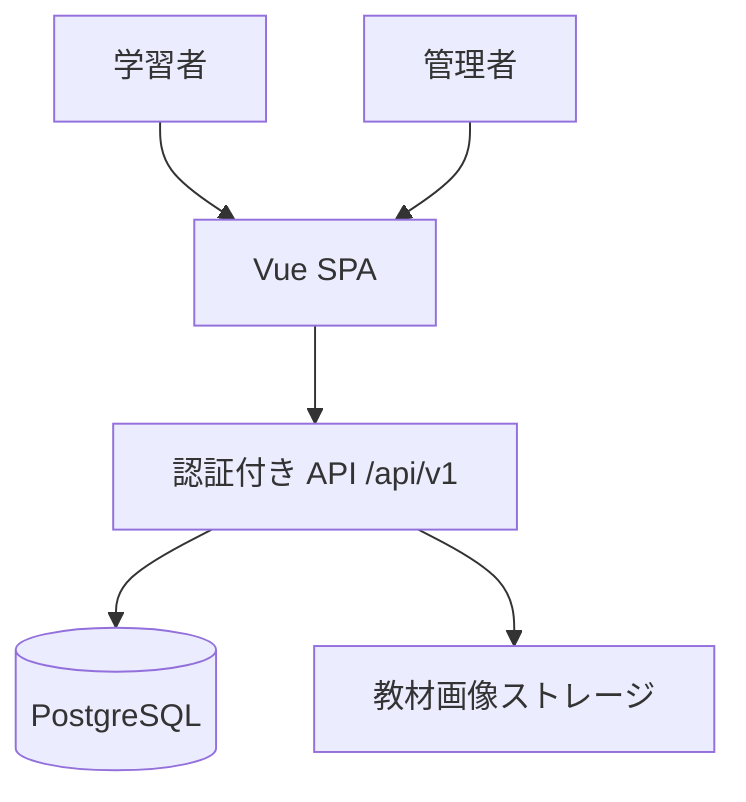
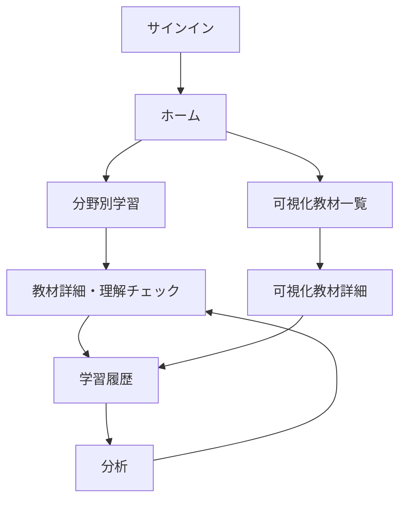
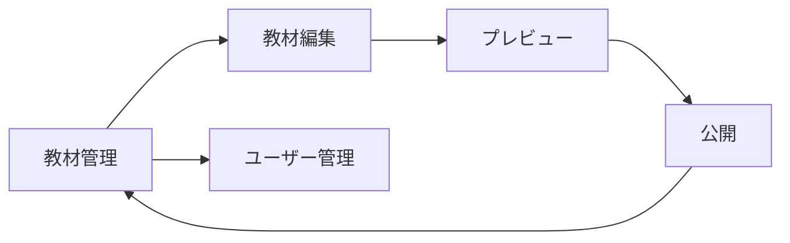
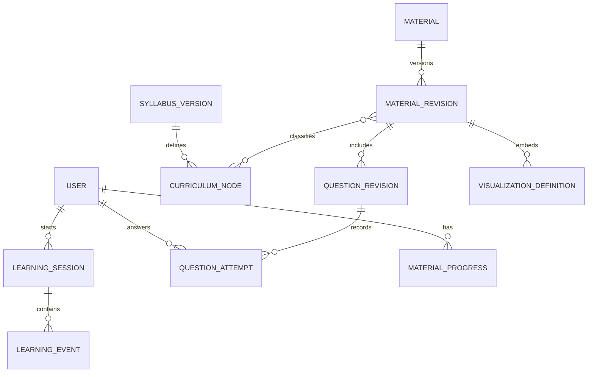
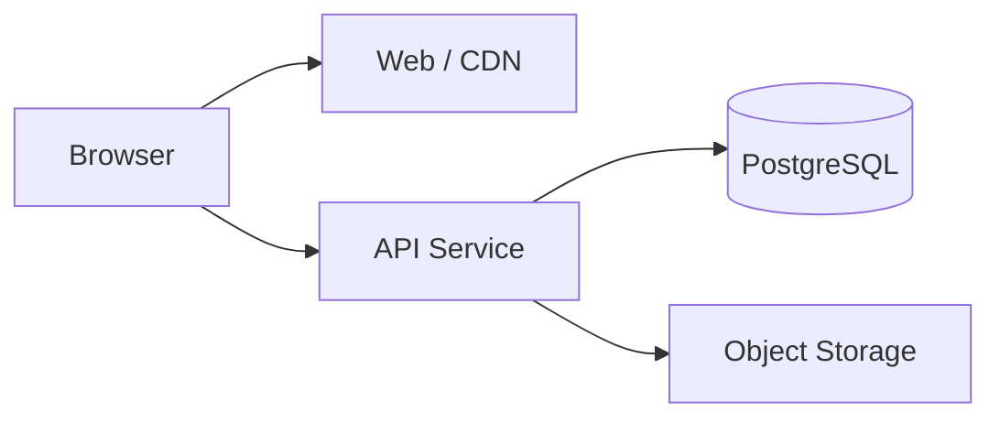

# 応用情報技術者試験 学習Webアプリ 設計書（レビュー反映版）

- 作成日: 2026-08-30
- レビュー日: 2026-08-30
- 対象: 学習者・管理者向けWebアプリ（PC・スマートフォン対応）
- 状態: 設計確定、未実装

## 0. レビュー結果

### 0.1 結論

初回設計のMVPは、学習機能に加えて本格的な教材編集、版履歴UI、詳細な学習履歴、苦手分析、推薦までを同時に含み、**一括実装するMVPとしては大きすぎました**。

確認結果に基づき、次の前提でMVPを再定義します。

- 利用者は `learner`（学習者）と `admin`（管理者）の2ロールとする。
- 学習履歴画面と分析画面をMVPに含める。
- フロントエンドと独立APIを別々にWebへデプロイする。
- 機能は削除せず、MVPで実装する深さを限定する。
- MVPを依存関係順の小さな段階に分け、各段階で動作確認できるようにする。

この結果、MVPは小規模ではなく**中規模の縦切りリリース**です。1回の大きな変更として実装せず、後述の実装順序に従って1機能群ずつ完成させます。

### 0.2 指摘と反映内容

| 確認観点           | 初回設計の評価                                           | レビュー反映                                                     |
| ------------------ | -------------------------------------------------------- | ---------------------------------------------------------------- |
| MVP規模            | 大きすぎる                                               | 画面を統合し、分析・管理の実装深度を限定。高度な機能を将来へ分離 |
| 機能の責務         | 層の説明はあるが、機能間の読み書き境界が不足             | 機能ごとの所有データ、許可する依存、API境界を明記                |
| 教材と分析の分離   | データ分類は分離済みだが、分析から教材への依存方向が曖昧 | 分析は履歴を読み取る派生機能とし、教材を更新できない構造に固定   |
| 履歴の拡張性       | イベント方式は適切だが、イベントの版と重複防止が不足     | `event_schema_version` と `idempotency_key` を追加               |
| 可視化教材の追加   | `rendererKey` は適切だが、追加時の契約が不足             | レンダラー、状態遷移、設定検証、登録表の4責務に分割              |
| スマートフォン対応 | 方針はあるが、可視化画面の狭幅時仕様が不足               | 縦積み、固定操作部、代替説明、タッチ・キーボード要件を追加       |
| Webデプロイ        | API分離の図だけで、公開時の要件が不足                    | デプロイ単位、SPAフォールバック、CORS、環境変数、DB移行を追加    |
| データ整合性       | `questions` と `questionRevisionId` の関係が不一致       | `questions` と `question_revisions` を明確に分離                 |
| 実装順序           | 未定義                                                   | 依存関係に基づく8段階と各完了条件を追加                          |

### 0.3 完了条件

- [x] MVPが定義されている
- [x] 画面一覧が決まっている
- [x] 画面遷移が決まっている
- [x] データ構造が決まっている
- [x] ディレクトリ構成が決まっている
- [x] 実装順序が決まっている

---

## 1. 設計の前提と原則

### 1.1 合意した前提

- 学習履歴はアカウント単位で保存する。
- 管理者は教材を登録・編集・公開し、学習者を有効・無効にできる。
- 利用者画面では「科目A／科目B」ではなく、学習テーマ・理解目標・演習形式で学習を導く。
- 初期の可視化教材には、既存方針のソート可視化を含める。
- フロントエンドは Vue 3 + TypeScript + Vite を使用する。
- Vue SPA、独立API、PostgreSQLを別のデプロイ単位として扱う。
- MVPの認証はメールアドレスとパスワードを入口とし、APIが安全なサーバーセッションを管理する前提とする。

### 1.2 コンテンツの基準

教材分類は、IPAの応用情報技術者試験シラバスの階層を基準にします。分類を画面コードへ直接書かず、シラバス版を持つデータとして管理します。

- 3系統: テクノロジ系／マネジメント系／ストラテジ系
- 大分類、中分類、小分類、学習目標を親子構造で保持する。
- 教材には参照したシラバス版を記録する。
- 問題形式の違いは `interactionMode` として保持し、UIの画面名へ固定しない。

参照: [IPA 試験要綱・シラバス](https://www.ipa.go.jp/shiken/syllabus/gaiyou.html)

### 1.3 設計原則

1. 正誤だけでなく「なぜそうなるか」を説明する。
2. 教材データ、可視化ロジック、表示コンポーネントを分離する。
3. 学習履歴の原本は追記型イベントと回答記録にする。
4. 分析結果は原本から再計算できる派生データにする。
5. 公開済み教材は上書きせず、公開版を追加する。
6. PC用とスマートフォン用にページを複製しない。
7. 管理画面から任意のJavaScriptやVueコードを実行させない。
8. API契約とDBスキーマの変更は後方互換性を確認してから行う。

---

## 2. MVPの定義

### 2.1 MVPの目的

学習者がサインインし、ソートを中心とする教材を「説明を読む → 動きを確認する → 問題に答える → 履歴と簡易分析を振り返る」まで一貫して行えることをMVPの価値とします。管理者は、その学習に必要な教材と学習者を最小限管理できることを含めます。

### 2.2 MVPに含めるもの

| 領域         | MVPの範囲                                                      | MVPで行わないこと                                    |
| ------------ | -------------------------------------------------------------- | ---------------------------------------------------- |
| 認証・権限   | サインイン、サインアウト、`learner` / `admin` の認可           | SSO、多要素認証、組織・クラス権限                    |
| ホーム       | 次に学ぶ教材、全体の完了数、可視化教材への導線                 | 学習計画自動生成、連続日数によるゲーミフィケーション |
| 分野別学習   | シラバス階層、テーマ選択、教材一覧、教材詳細                   | 全シラバス分の大量教材、全文横断検索、高度なフィルタ |
| 教材         | 説明、要点、図、例、用語、選択式理解チェック                   | 共同編集、承認ワークフロー、外部CMS連携              |
| 可視化       | 既存のソート可視化、凡例、変数、フローチャート、操作、確認問題 | 任意コード実行、汎用ノーコード可視化エディタ         |
| 学習履歴     | セッション一覧、日別学習時間、教材完了、回答結果               | 詳細カレンダー分析、CSV出力、長期保持ポリシーUI      |
| 分析         | テーマ別正答率、回答数、学習時間、苦手候補、次の教材候補       | AI推薦、予測モデル、他学習者比較、管理者向け分析     |
| 教材管理     | 教材一覧、ブロック編集、プレビュー、公開、テーマ関連付け       | 版差分画面、予約公開、一括インポート、承認フロー     |
| ユーザー管理 | 一覧、有効・無効、ロール表示                                   | 一括招待、組織、クラス、担当講師                     |
| UI           | PC／スマートフォン対応、キーボード操作、色以外の状態表現       | PWA、オフライン、ダークモード                        |

### 2.3 MVPの教材量

- 初期テーマはソートと、その理解に必要な前提教材に限定する。
- 可視化教材は既存のソート可視化1系統から開始する。
- 同じ `sort-v1` の設定違いは教材データの追加で対応する。
- 別の仕組みを持つ可視化教材は、将来レンダラーとして追加する。

### 2.4 将来機能

- 間隔反復、通知、目標日からの学習計画
- 二分探索、木・グラフ、DB正規化、ネットワーク、暗号などの可視化教材
- ケース問題、記述式添削、模擬試験、復習セット
- 組織、クラス、担当講師、学習者割当
- 教材の承認フロー、共同編集、インポート／エクスポート
- 誤答パターン分析、管理者向け匿名化集計、高度な推薦
- PWA、オフライン学習、ダークモード

---

## 3. 全体アーキテクチャと責務



### 3.1 デプロイ単位

| 単位    | 責務                                     | 公開形態                                                |
| ------- | ---------------------------------------- | ------------------------------------------------------- |
| Web     | 画面表示、入力、教材描画、可視化操作     | Viteで生成した静的ファイルをCDN／静的ホスティングへ配置 |
| API     | 認証・認可、教材公開、履歴保存、分析取得 | 独立したWebサービスまたはコンテナ                       |
| DB      | ユーザー、教材版、回答、イベント、集計   | 管理対象のPostgreSQL。外部へ直接公開しない              |
| Storage | 教材画像・図                             | APIが許可したファイルだけを扱う。MVPでは必要最小限      |

Vue RouterのHTML5 Historyモードを使うため、静的ホスティングは存在しないパスを `index.html` へ戻すSPAフォールバックを設定します。VueのSPAでは公式のVue Routerを使用します。参照: [Vue Router: History modes](https://router.vuejs.org/guide/essentials/history-mode.html)

### 3.2 機能責務

| 機能         | 所有する責務                         | 読み取り元                     | 更新してよいデータ                 |
| ------------ | ------------------------------------ | ------------------------------ | ---------------------------------- |
| 認証         | 本人確認、セッション、ロール判定     | ユーザー                       | セッション、最終ログイン           |
| 教材カタログ | 分類、テーマ、公開教材の検索・取得   | シラバス、教材公開版           | なし（管理機能経由のみ）           |
| 教材表示     | ブロックの安全な描画、学習位置の通知 | 公開教材、進捗                 | 学習イベント、進捗                 |
| 演習         | 回答受付、採点、解説表示             | 問題公開版                     | 回答記録、学習イベント             |
| 可視化実行   | 状態遷移、描画、操作説明             | 可視化定義                     | 学習イベント、進捗                 |
| 履歴         | 学習者本人の時系列表示               | セッション、イベント、回答     | なし                               |
| 分析         | 原本から指標を算出し、根拠付きで表示 | 回答、イベント、進捗、テーマID | 派生集計のみ                       |
| 教材管理     | 下書き編集、検証、プレビュー、公開   | 教材、シラバス                 | 教材下書き、新しい公開版、監査ログ |
| ユーザー管理 | 学習者の有効・無効                   | ユーザー、ロール               | ユーザー状態、監査ログ             |

### 3.3 教材機能と分析機能の分離

- 教材は学習内容の原本を所有し、分析値を保持しない。
- 履歴は「誰が、いつ、どの公開版で、何をしたか」を所有する。
- 分析は履歴を読み取るだけで、教材・回答・イベントを更新しない。
- 分析結果から教材へ移動する場合も、渡すのは `topicId` または `materialId` だけとする。
- 教材の修正後も過去結果を説明できるよう、回答とイベントは回答時点の `materialRevisionId` / `questionRevisionId` を参照する。
- 派生集計を削除しても、イベントと回答から再計算できることを必須とする。

---

## 4. 画面一覧

### 4.1 学習者画面

| 画面           | ルート                             | 目的                         | MVP要素                                    |
| -------------- | ---------------------------------- | ---------------------------- | ------------------------------------------ |
| サインイン     | `/sign-in`                         | アカウントに紐付けて利用する | メール、パスワード、エラー表示             |
| ホーム         | `/`                                | 次の学習を迷わず始める       | 次の教材、完了数、可視化への導線           |
| 分野別学習     | `/learn`                           | 分野・テーマ・教材を選ぶ     | 分類ナビ、テーマ一覧、教材カード           |
| 教材詳細       | `/materials/:materialId`           | 説明・例・問題で理解する     | ブロック教材、インライン理解チェック、進捗 |
| 可視化教材一覧 | `/visualizations`                  | 動かせる教材を探す           | 教材カード、テーマ、難易度、所要時間       |
| 可視化教材詳細 | `/visualizations/:visualizationId` | 状態変化と理由を理解する     | 操作、凡例、変数、フロー、確認問題         |
| 学習履歴       | `/history`                         | 学習した事実を振り返る       | 日別学習時間、セッション、教材、回答結果   |
| 分析           | `/analysis`                        | 苦手候補と次の行動を知る     | 正答率、回答数、学習時間、根拠、教材導線   |

テーマ詳細と独立した演習・結果ページはMVPでは作らず、分野別学習と教材詳細へ統合します。これにより画面遷移と状態管理を減らします。

### 4.2 管理者画面

| 画面         | ルート                              | 目的                       | MVP要素                                        |
| ------------ | ----------------------------------- | -------------------------- | ---------------------------------------------- |
| 教材管理     | `/admin/materials`                  | 教材を探して作成・編集する | 一覧、状態、作成、編集導線                     |
| 教材編集     | `/admin/materials/:materialId/edit` | 下書きを編集し公開する     | ブロック編集、テーマ関連付け、プレビュー、公開 |
| ユーザー管理 | `/admin/users`                      | 利用可否を管理する         | 一覧、有効・無効、ロール表示                   |

管理ダッシュボード、分類編集、版差分専用画面はMVPから外します。分類は初期データとして投入し、教材編集画面で関連付けだけを行います。

### 4.3 ルート制御

- 未認証で保護ページへアクセスした場合は `/sign-in` へ移動する。
- 認証後は元の安全なアプリ内パスへ戻す。
- `admin` 以外が `/admin/*` へアクセスした場合は403画面を表示する。
- 存在しない教材は404、非公開教材は学習者に404相当として扱う。
- APIの401／403を画面側のルート制御だけに頼らず、APIでも必ず判定する。

---

## 5. 画面遷移

### 5.1 学習者



主要ナビゲーションから、ホーム・学習・可視化・履歴・分析へ常に移動できます。分析から教材へ戻る導線には、推薦理由を表示します。

### 5.2 管理者



プレビューは編集ページ内のモード切替とし、別ルート・別画面にはしません。

---

## 6. 主要機能仕様

### 6.1 初心者向け教材

- ホームには次に行う学習を1件だけ主表示する。
- 教材は `目標 → 説明 → 図／例 → 操作・確認 → 理由 → 要点` を基本順序とする。
- 問題は正解理由と各誤答の誤りを表示する。
- 用語には短い定義を付け、説明の途中で迷子にさせない。
- 進捗保存に失敗した場合は学習内容を隠さず、再試行できる状態を示す。

### 6.2 可視化教材

ソート可視化では次を提供します。

- 配列をバー等で表示し、比較中・交換中・確定済みを色、文字、記号で区別する。
- `i`、`j`、最小値位置などの変数名と現在値を表示する。
- 1ステップ、自動再生、一時停止、速度変更、リスタート、シャッフルを提供する。
- 現在実行中の処理をフローチャートまたは読みやすい線形ステップで示す。
- 分岐はひし形、反復の範囲は開始・終了が分かる図形で示す。狭幅で読みにくい場合は線形表示へ切り替える。
- 各節目に「なぜこの比較をするか」と確認問題を表示する。

可視化の責務は次の4つに分けます。

| 部分         | 責務                                                     |
| ------------ | -------------------------------------------------------- |
| `definition` | 教材名、レンダラーキー、設定、初期状態、チェックポイント |
| `engine`     | 入力状態から次の状態を純粋に計算する                     |
| `renderer`   | 現在状態をVueで描画する                                  |
| `registry`   | 許可したキーと設定検証・engine・rendererを対応付ける     |

同じレンダラーを使う教材はデータ追加だけで増やせます。新しい仕組みの可視化は、engine、renderer、設定スキーマ、registry登録、テストを1組として追加します。

### 6.3 学習履歴

- セッション開始・終了、教材閲覧、進捗更新、可視化操作、回答、完了を記録する。
- 回答内容の原本は `question_attempts`、時系列の原本は `learning_events` とする。
- API再送による二重記録を `idempotency_key` で防ぐ。
- 新しいイベント種別は既存行を変更せず追加できる。
- 不明なイベントを受け取った古い画面は、壊れずに「その他の学習」として表示できるようにする。

### 6.4 分析

MVPの分析は説明可能なルールに限定します。

- テーマ別正答率 = 正解数 ÷ 採点済み回答数
- 学習時間 = 有効なセッション区間の合計
- 苦手候補 = 最低回答数を満たし、正答率が基準未満のテーマ
- 次の教材候補 = 誤答テーマ、未完了教材、長期間未学習の順で候補化
- 画面には正答率だけでなく、回答数、対象期間、最終学習日、推薦理由を併記する。
- 回答数が少ない場合は「苦手」と断定せず「データ不足」と表示する。

閾値はAPIの設定値として保持し、教材コンポーネントへ埋め込みません。

### 6.5 教材管理

- 管理者は下書きを作成し、学習者と同じ描画部品でプレビューする。
- 公開前にブロック構造、参照先、問題の正解、可視化設定をAPIで検証する。
- 公開時は新しい `material_revision` を作り、既存公開版を上書きしない。
- 学習者APIは公開済み版だけを返す。
- 公開・ユーザー状態変更は監査ログへ記録する。

---

## 7. データ構造

### 7.1 データ分類

| 分類       | 原本                                                                                 | 更新者                                      |
| ---------- | ------------------------------------------------------------------------------------ | ------------------------------------------- |
| 基準データ | `syllabus_versions`, `curriculum_nodes`                                              | 初期投入処理。MVP中は管理画面から変更しない |
| 教材データ | `materials`, `material_revisions`, `question_revisions`, `visualization_definitions` | 教材管理                                    |
| 学習データ | `learning_sessions`, `learning_events`, `question_attempts`                          | 学習機能から追記                            |
| 現在状態   | `material_progress`                                                                  | 学習機能が更新。履歴原本ではない            |
| 派生データ | `daily_learning_summaries`, `topic_metrics`                                          | 集計処理。再生成可能                        |

### 7.2 エンティティ関係



### 7.3 主要テーブル

| テーブル                    | 主な項目                                                                                                                                      | 制約・用途                                             |
| --------------------------- | --------------------------------------------------------------------------------------------------------------------------------------------- | ------------------------------------------------------ |
| `users`                     | `id`, `email`, `password_hash`, `display_name`, `status`, `created_at`, `updated_at`                                                          | `email` は正規化して一意。パスワード平文は保存しない   |
| `user_roles`                | `user_id`, `role`                                                                                                                             | MVPは `learner` / `admin`                              |
| `auth_sessions`             | `id`, `user_id`, `expires_at`, `revoked_at`                                                                                                   | サーバーセッション。ブラウザには安全なCookieだけを渡す |
| `syllabus_versions`         | `id`, `name`, `published_at`, `source_url`                                                                                                    | シラバス改訂に対応                                     |
| `curriculum_nodes`          | `id`, `syllabus_version_id`, `parent_id`, `node_type`, `code`, `name`, `learning_objective`, `sort_order`                                     | 分類ツリー                                             |
| `materials`                 | `id`, `slug`, `kind`, `current_published_revision_id`, `created_at`                                                                           | 教材の固定ID                                           |
| `material_revisions`        | `id`, `material_id`, `revision_no`, `schema_version`, `status`, `title`, `summary`, `blocks`, `published_at`                                  | 下書き・公開版。`material_id + revision_no` は一意     |
| `material_revision_topics`  | `material_revision_id`, `curriculum_node_id`, `relation_type`                                                                                 | 公開時点のテーマ対応を保持                             |
| `questions`                 | `id`, `created_at`                                                                                                                            | 問題の固定ID                                           |
| `question_revisions`        | `id`, `question_id`, `material_revision_id`, `revision_no`, `interaction_mode`, `content`, `published_at`                                     | 回答時点の問題を特定                                   |
| `visualization_definitions` | `id`, `material_revision_id`, `renderer_key`, `renderer_version`, `config`, `initial_state`                                                   | 許可済みレンダラーだけを指定                           |
| `learning_sessions`         | `id`, `user_id`, `started_at`, `ended_at`, `entry_point`, `device_type`                                                                       | 1回の学習単位                                          |
| `learning_events`           | `id`, `user_id`, `session_id`, `event_type`, `event_schema_version`, `occurred_at`, `received_at`, `idempotency_key`, `references`, `payload` | 追記型の時系列原本                                     |
| `question_attempts`         | `id`, `user_id`, `session_id`, `question_revision_id`, `answer`, `is_correct`, `elapsed_ms`, `answered_at`                                    | 回答の原本                                             |
| `material_progress`         | `user_id`, `material_id`, `material_revision_id`, `status`, `last_block_id`, `time_spent_sec`, `updated_at`                                   | 現在の表示用状態。複合一意制約                         |
| `daily_learning_summaries`  | `user_id`, `study_date`, `time_spent_sec`, `completed_count`, `calculated_at`                                                                 | 日別表示用の派生値                                     |
| `topic_metrics`             | `user_id`, `curriculum_node_id`, `correct_count`, `attempt_count`, `time_spent_sec`, `last_activity_at`, `calculated_at`                      | 分析用の派生値                                         |
| `audit_logs`                | `id`, `actor_user_id`, `action`, `target_type`, `target_id`, `metadata`, `created_at`                                                         | 公開・権限変更の監査                                   |

### 7.4 共通データ規則

- 主キーは推測不能なUUIDを使用する。
- 日時はUTCで保存し、表示時に利用者のタイムゾーンへ変換する。
- APIが受け取る日時とは別に `received_at` を保存する。
- 公開済み教材・問題は直接更新せず、新しいリビジョンを作る。
- JSON列には必ず対応する `schema_version` を持たせる。
- API入力はAPI側で検証し、クライアントのTypeScript型だけを信頼しない。
- 学習者は本人の履歴だけを取得できるよう、すべての履歴APIで所有者を検証する。
- 派生集計は削除・再計算できるため、履歴の唯一の原本にしない。

---

## 8. 教材データ構造

### 8.1 教材ブロック

教材を巨大なHTML文字列ではなく、安定した `blockId` を持つ型付きブロック配列として保存します。

```ts
type MaterialKind = "lesson" | "visualization";
type PublishStatus = "draft" | "published" | "archived";

interface MaterialRevisionContent {
  schemaVersion: 1;
  title: string;
  summary: string;
  learningObjectives: string[];
  prerequisiteTopicIds: string[];
  estimatedMinutes: number;
  difficulty: 1 | 2 | 3 | 4 | 5;
  blocks: ContentBlock[];
  source: ContentSource;
}

type ContentBlock =
  | ExplainBlock
  | CalloutBlock
  | DiagramBlock
  | ExampleBlock
  | GlossaryBlock
  | VisualizationRefBlock
  | CheckpointQuizBlock;
```

| ブロック                | 主なデータ                            | 責務               |
| ----------------------- | ------------------------------------- | ------------------ |
| `ExplainBlock`          | `blockId`, 見出し、Markdown本文       | 概念説明           |
| `CalloutBlock`          | `blockId`, 種別、要点、理由           | 注意・試験ポイント |
| `DiagramBlock`          | `blockId`, 画像ID、代替テキスト、説明 | 図解               |
| `ExampleBlock`          | `blockId`, 状況、手順、結論           | 具体例             |
| `GlossaryBlock`         | `blockId`, 用語と短い定義             | 初心者向け補足     |
| `VisualizationRefBlock` | `blockId`, `visualizationId`, 導入文  | 可視化定義への参照 |
| `CheckpointQuizBlock`   | `blockId`, `questionIds`, 合格条件    | 理解確認           |

Markdownは許可した記法だけをサニタイズして描画し、教材データ内のHTMLやスクリプトをそのまま実行しません。

### 8.2 問題データ

```ts
type InteractionMode = "single_choice" | "multiple_choice";

interface QuestionRevisionContent {
  schemaVersion: 1;
  interactionMode: InteractionMode;
  stem: string;
  choices: Choice[];
  correctChoiceIds: string[];
  explanation: string;
  misconceptionExplanations: Record<string, string>;
  topicIds: string[];
  difficulty: 1 | 2 | 3 | 4 | 5;
}

interface Choice {
  id: string;
  label: string;
  text: string;
}
```

MVPでは自動採点可能な選択式に限定します。記述式とケース問題はデータ型を追加する将来機能とし、未使用の複雑な採点責務をMVPへ入れません。

### 8.3 可視化定義

```ts
interface VisualizationDefinition {
  id: string;
  materialRevisionId: string;
  rendererKey: "sort-v1";
  rendererVersion: 1;
  configSchemaVersion: 1;
  config: SortVisualizationConfig;
  initialState: SortState;
  checkpoints: VisualizationCheckpoint[];
}

interface SortVisualizationConfig {
  algorithmKeys: Array<"bubble" | "selection" | "insertion">;
  defaultAlgorithmKey: "bubble" | "selection" | "insertion";
  minArrayLength: number;
  maxArrayLength: number;
  showFlowchart: boolean;
  showVariables: boolean;
}
```

管理画面は設定データだけを保存し、レンダラー実装や任意コードは保存できません。`rendererKey` とバージョンが未対応の場合は、安全な非対応メッセージを表示します。

### 8.4 出典・権利情報

```ts
interface ContentSource {
  sourceType: "original" | "official_reference" | "licensed" | "adapted";
  title: string;
  url?: string;
  licenseNote?: string;
  attribution?: string;
}
```

MVPは独自作成教材と公式ページへの参照を中心にし、転載物は利用条件と出典表示を確認してから登録します。

---

## 9. 学習履歴・分析データ構造

### 9.1 イベント契約

```ts
type LearningEventType =
  | "session_started"
  | "session_ended"
  | "material_opened"
  | "progress_updated"
  | "visualization_operated"
  | "question_answered"
  | "material_completed";

interface LearningEvent {
  id: string;
  userId: string;
  sessionId: string;
  type: LearningEventType;
  eventSchemaVersion: 1;
  occurredAt: string;
  receivedAt: string;
  idempotencyKey: string;
  references: {
    materialRevisionId?: string;
    questionRevisionId?: string;
    questionAttemptId?: string;
    visualizationDefinitionId?: string;
    topicId?: string;
  };
  payload: Record<string, unknown>;
}
```

新しい履歴項目はイベント型とスキーマ版を追加して対応します。既存イベントの意味を変更しません。分析は `eventSchemaVersion` ごとの変換処理を通し、古い履歴も再計算できるようにします。

### 9.2 回答と進捗

```ts
interface QuestionAttempt {
  id: string;
  userId: string;
  sessionId: string;
  questionRevisionId: string;
  answer: { selectedChoiceIds: string[] };
  isCorrect: boolean;
  elapsedMs: number;
  answeredAt: string;
}

interface MaterialProgress {
  userId: string;
  materialId: string;
  materialRevisionId: string;
  status: "not_started" | "in_progress" | "completed" | "review";
  lastBlockId: string | null;
  timeSpentSec: number;
  completedAt: string | null;
  updatedAt: string;
}
```

`material_progress` は高速表示用の現在値です。過去の時系列はイベントから取得し、進捗行の上書きだけで履歴を失わないようにします。

---

## 10. ディレクトリ構成

独立デプロイを前提とし、1つのリポジトリ内でWeb、API、共有契約を分けます。バックエンドフレームワークの選択に依存しない境界です。

```text
ap-study-app/
├── apps/
│   ├── web/                         # Vue 3 + TypeScript + Vite
│   │   ├── public/
│   │   ├── src/
│   │   │   ├── app/
│   │   │   │   ├── router/
│   │   │   │   ├── providers/
│   │   │   │   ├── styles/
│   │   │   │   ├── App.vue
│   │   │   │   └── main.ts
│   │   │   ├── pages/
│   │   │   │   ├── home/
│   │   │   │   ├── learn/
│   │   │   │   ├── material/
│   │   │   │   ├── visualizations/
│   │   │   │   ├── history/
│   │   │   │   ├── analysis/
│   │   │   │   ├── auth/
│   │   │   │   └── admin/
│   │   │   ├── widgets/
│   │   │   │   ├── app-shell/
│   │   │   │   ├── curriculum-browser/
│   │   │   │   ├── material-reader/
│   │   │   │   ├── visualization-player/
│   │   │   │   ├── history-timeline/
│   │   │   │   └── analysis-summary/
│   │   │   ├── features/
│   │   │   │   ├── auth/
│   │   │   │   ├── answer-question/
│   │   │   │   ├── record-learning/
│   │   │   │   ├── control-visualization/
│   │   │   │   ├── edit-material/
│   │   │   │   ├── publish-material/
│   │   │   │   └── manage-user/
│   │   │   ├── entities/
│   │   │   │   ├── user/
│   │   │   │   ├── curriculum/
│   │   │   │   ├── material/
│   │   │   │   ├── question/
│   │   │   │   ├── visualization/
│   │   │   │   └── learning-record/
│   │   │   └── shared/
│   │   │       ├── api/
│   │   │       ├── config/
│   │   │       ├── lib/
│   │   │       ├── ui/
│   │   │       └── utils/
│   │   └── tests/
│   └── api/
│       ├── src/
│       │   ├── modules/
│       │   │   ├── auth/
│       │   │   ├── users/
│       │   │   ├── curriculum/
│       │   │   ├── materials/
│       │   │   ├── learning-records/
│       │   │   └── analytics/
│       │   ├── middleware/
│       │   ├── config/
│       │   └── server/
│       └── tests/
├── packages/
│   └── api-contracts/               # API要求・応答の共有型。DB型は置かない
├── database/
│   ├── migrations/
│   └── seeds/                        # シラバスと初期教材
├── docs/
├── infra/                            # デプロイ設定。環境別秘密情報は置かない
└── package.json
```

### 10.1 Vue側の依存規則

| 層         | 責務                                       | 依存先                                      |
| ---------- | ------------------------------------------ | ------------------------------------------- |
| `app`      | 起動、ルーター、全体provider、全体スタイル | 全層                                        |
| `pages`    | ルート単位の組み立て                       | `widgets`, `features`, `entities`, `shared` |
| `widgets`  | 複数機能を組み合わせた大きな画面領域       | `features`, `entities`, `shared`            |
| `features` | 回答、記録、公開など利用者の操作           | `entities`, `shared`                        |
| `entities` | ドメイン型、表示、APIマッパー              | `shared`                                    |
| `shared`   | 汎用UI、HTTP、設定、純粋関数               | 他の上位層へ依存しない                      |

- 同じ層の別機能を無秩序に横断参照しない。
- `pages` に採点、分析、可視化の状態遷移を書かない。
- `.vue` から直接 `fetch` せず、各機能・エンティティのAPI関数を通す。
- Piniaは認証、表示設定、可視化の一時操作状態に限定する。APIの全応答を永続的なグローバル状態へ複製しない。PiniaはVueコアチームが維持する状態管理ライブラリです。参照: [Vue: State Management](https://vuejs.org/guide/scaling-up/state-management)

### 10.2 可視化教材の配置

```text
entities/visualization/
├── model/
│   ├── definition.ts
│   └── registry.ts
├── renderers/
│   └── sort-v1/
│       ├── SortRenderer.vue
│       ├── sort-engine.ts
│       ├── sort-config.ts
│       └── components/
└── api/
```

新しい可視化方式は `renderers/<renderer-key>/` に閉じ、既存レンダラーを変更せずregistryへ追加できる形にします。

---

## 11. コンポーネント構成

### 11.1 共通レイアウト

```text
AppShell
├── AppHeader
├── DesktopSideNav
├── MobileBottomNav
├── AppMain
└── GlobalFeedbackRegion
```

`DesktopSideNav` と `MobileBottomNav` は同じナビゲーション定義を読み、CSSで表示方法だけを切り替えます。

### 11.2 画面別コンポーネント

| 画面         | 主なコンポーネント                                                                                                        |
| ------------ | ------------------------------------------------------------------------------------------------------------------------- |
| ホーム       | `NextStudyCard`, `ProgressSummary`, `VisualizationEntryCard`                                                              |
| 分野別学習   | `CurriculumNavigator`, `TopicList`, `MaterialCard`                                                                        |
| 教材詳細     | `MaterialReader`, `ContentBlockRenderer`, `GlossaryDisclosure`, `CheckpointQuiz`, `LearningProgressBar`                   |
| 可視化一覧   | `VisualizationCardList`, `VisualizationCard`                                                                              |
| 可視化詳細   | `VisualizationPlayer`, `VisualizationControlBar`, `StateLegend`, `VariableInspector`, `FlowchartPanel`, `CheckpointPanel` |
| 履歴         | `DailyLearningSummary`, `LearningTimeline`, `SessionCard`                                                                 |
| 分析         | `TopicMetricList`, `EvidenceSummary`, `WeakTopicCandidateList`, `RecommendedMaterialCard`                                 |
| 教材管理     | `MaterialTable`, `MaterialEditor`, `BlockEditor`, `CurriculumMapper`, `MaterialPreview`, `PublishDialog`                  |
| ユーザー管理 | `UserTable`, `UserStatusControl`, `RoleBadge`                                                                             |

### 11.3 可視化コンポーネント境界

```text
VisualizationPlayer
├── VisualizationHeader
├── ActiveRenderer
│   └── SortRenderer
├── VisualizationControlBar
├── StateLegend
├── VariableInspector
├── FlowchartPanel
└── CheckpointPanel
```

- `VisualizationPlayer` は定義取得、共通レイアウト、進捗通知を担当する。
- `SortRenderer` はソート状態の描画だけを担当する。
- `sort-engine.ts` はDOMやVueへ依存せず、1ステップ後の状態を計算する。
- `VisualizationControlBar` はengineへ操作を通知し、アルゴリズム自体を実装しない。
- `StateLegend`、`VariableInspector`、`FlowchartPanel` は現在状態を受け取る表示部品とする。
- `CheckpointPanel` は演習機能を利用し、回答保存を直接実装しない。

### 11.4 教材描画

- `ContentBlockRenderer` はブロック種別と描画部品を明示的に対応付ける。
- 未知のブロックは画面全体を壊さず、非対応ブロックとして表示・記録する。
- 学習者画面と管理プレビューは同じブロック描画部品を使用する。
- 教材本文や問題文をコンポーネント内へ直接記述しない。

---

## 12. スマートフォン対応

### 12.1 共通方針

- モバイルファーストの1カラムを基本とし、広い画面で補助カラムを追加する。
- 主要5画面はスマートフォンで下部ナビゲーション、PCでサイドナビゲーションを使う。
- タップ領域は原則44px以上とし、操作間隔を確保する。
- ホバーだけで情報や操作を提供しない。
- 色だけで状態を伝えず、文字、形、アイコンを併用する。
- キーボードのフォーカス順とフォーカス表示を保つ。
- 長い表はカード化を優先し、必要な表だけ列固定・横スクロールを許可する。

### 12.2 可視化画面

| 画面幅         | 配置                                                                    |
| -------------- | ----------------------------------------------------------------------- |
| スマートフォン | 可視化 → 現在の説明 → 変数 → フローの縦積み。操作部は画面下部に固定可能 |
| タブレット     | 可視化を上段、説明・変数を2列で下段に配置                               |
| PC             | 可視化と説明を主従2カラムにし、操作部を近接配置                         |

- 縦向きのまま主要操作を完了できるようにし、横向きを強制しない。
- バーが多い場合は値を間引くのではなく、MVPの最大配列長を制限する。
- フローチャートが狭くなる場合は、現在処理を強調した線形ステップ表示へ切り替える。
- 自動再生中でも一時停止ボタンを常に見える位置に置く。
- アニメーションを減らすOS設定がある場合は、移動時間を短縮または無効化する。

### 12.3 レスポンシブ検証幅

最低限、360px、768px、1024px、1440px相当で確認します。固定幅端末名ではなく、内容が崩れる境界を基準にCSSブレークポイントを調整します。

---

## 13. Webデプロイ設計

### 13.1 構成



- WebとAPIは同じ親ドメイン配下を推奨する。例: `app.example.com` と `api.example.com`。
- APIは `/api/v1` で版を固定し、画面のデプロイとAPI変更を分離する。
- DBはプライベート接続とし、ブラウザから直接接続しない。
- 教材画像はAPIが発行・検証した参照だけを保存する。
- 認証Cookieは `Secure`、`HttpOnly`、適切な `SameSite` を設定する。
- 許可するWebオリジンを環境ごとに限定し、CORSのワイルドカードと認証Cookieを併用しない。

### 13.2 環境

| 環境       | 用途             | データ                   |
| ---------- | ---------------- | ------------------------ |
| local      | 開発             | 開発用seed               |
| staging    | 結合・公開前確認 | 本番と分離した検証データ |
| production | 利用者向け       | 本番データ               |

- Webへ渡す `VITE_*` にはAPIベースURLなど公開可能な値だけを置く。
- DBパスワード、署名鍵、ストレージ資格情報はAPI環境の秘密情報として管理する。
- Viteの `VITE_*` 値はビルド成果物へ含まれるため、秘密情報を置かない。参照: [Vite: Env Variables and Modes](https://vite.dev/guide/env-and-mode)

### 13.3 デプロイ順序

1. 後方互換性のあるDB migrationを適用する。
2. 新旧Webの両方を受け入れられるAPIをデプロイする。
3. APIのhealth checkと主要読み書きを確認する。
4. Webをデプロイし、SPAフォールバックを確認する。
5. サインイン、教材閲覧、回答、履歴、管理公開をsmoke testする。
6. 問題がある場合はWeb／APIを直前版へ戻す。破壊的DB変更は別リリースで行う。

### 13.4 運用要件

- APIにhealth checkを設ける。
- 構造化ログにリクエストIDを付け、パスワード・回答本文などの機微情報を記録しない。
- DBの自動バックアップと復元手順を用意する。
- 教材公開・ユーザー状態変更は監査ログで追跡する。
- 静的アセットはハッシュ付きファイル名でキャッシュし、`index.html` は短いキャッシュにする。
- API障害時は教材表示、回答保存、履歴取得のどこで失敗したかを画面に区別して示す。

### 13.5 Web公開適合性の判定

上記を反映した構成はWeb公開に適しています。Vue SPAを静的配信し、独立APIとDBを分離できるため、画面更新とデータ処理を個別にデプロイできます。一方で、初回設計のままではSPAフォールバック、環境変数、CORS、migration、rollbackが未定義だったため、公開準備は不十分でした。

---

## 14. API境界

MVPで必要なAPI群を次の責務に分けます。パスの詳細はAPI設計時にOpenAPI等で固定します。

| API群                       | 主な操作                                   |
| --------------------------- | ------------------------------------------ |
| `/api/v1/auth`              | サインイン、サインアウト、現在ユーザー取得 |
| `/api/v1/curriculum`        | 公開分類・テーマ取得                       |
| `/api/v1/materials`         | 公開教材一覧・詳細取得                     |
| `/api/v1/visualizations`    | 公開可視化定義取得                         |
| `/api/v1/learning-sessions` | セッション開始・終了                       |
| `/api/v1/learning-events`   | イベント追記                               |
| `/api/v1/question-attempts` | 回答・採点結果登録                         |
| `/api/v1/history`           | 本人の履歴取得                             |
| `/api/v1/analytics`         | 本人の派生指標・推薦理由取得               |
| `/api/v1/admin/materials`   | 下書き作成・更新・検証・公開               |
| `/api/v1/admin/users`       | ユーザー一覧・有効無効                     |

履歴APIと分析APIは教材本文を複製して返さず、表示に必要な安定IDと時点タイトルを返します。教材の完全な内容は教材APIが所有します。

---

## 15. 実装順序

実装はまだ開始しません。着手時は次の順序で、各段階を小さな変更として完了させます。

| 段階 | 実装対象             | 完了条件                                                       | 主な回帰確認                                      |
| ---- | -------------------- | -------------------------------------------------------------- | ------------------------------------------------- |
| 0    | 契約と土台           | Web/API起動、DB migration、seed、共通エラー形式、CIが動く      | build、型検査、migration往復不可変更の確認        |
| 1    | 認証・共通UI         | learner/adminでサインインし、認可された空ページへ移動できる    | 401、403、サインアウト、360pxナビ                 |
| 2    | 分野別学習・教材表示 | seed教材を一覧から開き、全ブロックを表示できる                 | 非公開教材、404、未知ブロック、PC/スマホ          |
| 3    | 可視化教材           | 既存ソート機能を組み込み、全操作・凡例・変数・フローが動く     | 1ステップ、自動再生、停止、速度、再開、シャッフル |
| 4    | 回答・学習記録       | 理解チェックを採点し、イベント・回答・進捗が重複なく保存される | 再送、通信失敗、教材版参照、別ユーザー分離        |
| 5    | 履歴・分析           | 本人の履歴と簡易指標、根拠付き教材候補を表示できる             | データ不足、日付境界、集計再計算、0件表示         |
| 6    | 管理機能             | 教材の下書き・プレビュー・公開、ユーザー無効化ができる         | 学習者の管理API拒否、公開版不変、監査ログ         |
| 7    | 統合・公開確認       | stagingへ公開し、主要フローと復旧手順を確認できる              | E2E、アクセシビリティ、主要幅、API障害、rollback  |

### 15.1 各段階のルール

- 次の段階へ進む前に、その段階の完了条件を満たす。
- 要求されていない既存機能を変更しない。
- 可視化教材の組み込み前後で既存ソート操作の回帰テストを行う。
- DB変更はmigrationで管理し、手作業だけの本番変更を行わない。
- 実装完了時は変更ファイル、変更内容、テスト結果、残課題を報告する。

---

## 16. テスト方針

| 種別                 | 対象                                                                  |
| -------------------- | --------------------------------------------------------------------- |
| 単体テスト           | ソートengine、採点、分析集計、推薦ルール、データ変換                  |
| コンポーネントテスト | 教材ブロック、問題、可視化操作、レスポンシブナビ                      |
| API統合テスト        | 認証、認可、教材公開、イベント重複防止、本人データ分離                |
| 契約テスト           | WebとAPIの要求・応答、schema version、エラー形式                      |
| E2E                  | サインイン → 学習 → 回答 → 履歴 → 分析、管理者の編集 → 公開           |
| 視覚・操作確認       | 360/768/1024/1440px、キーボード、色以外の状態表示、アニメーション低減 |
| デプロイ確認         | SPA直リンク、環境変数、health check、migration、smoke test、rollback  |

---

## 17. 設計確定事項と実装時の選択事項

### 設計確定事項

- MVPは学習者と管理者の2ロールを対象とする。
- 履歴・簡易分析をMVPへ含める。
- Vue SPAと独立APIを別々にデプロイする。
- 初期教材はソートを中心に絞る。
- 教材、学習履歴、分析を別責務・別API群として扱う。
- イベント原本と再計算可能な派生集計を分ける。
- 可視化教材は許可済みレンダラー登録方式で追加する。
- 画面一覧、遷移、データ構造、ディレクトリ構成、実装順序は本書を基準とする。

### 実装開始前に技術選定で決める事項

次は設計の欠落ではなく、実装フェーズ0で比較・決定する技術選択です。

- APIフレームワークとDBアクセス方式
- Web/API/DBの具体的なホスティングサービス
- メール送信が必要になった場合の配信サービス
- 画像アップロードをMVP初期から有効にするか、seed画像だけに限定するか

これらを選んでも、本書の画面責務、API境界、データ所有、実装順序は変更しません。
